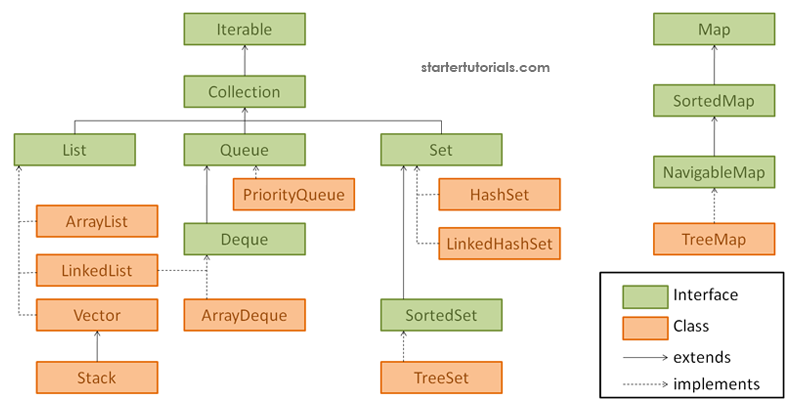

## Collections, Interfaces, ADTS
### Lab 7 | 7/1


---

## Announcements

- Project Party, 4-6PM Pac Tonite in Woz or Online
- Project 1 is due on Sunday, 7/3 at 11:59 PM
- Quiz 3 closes at 6 PM today
- Redemption quiz 2 closes at 6 PM today
- No lab next Monday
- Lab 7 is due 22 hours from now!

> have a good long weekend :)
<!-- .element: class="fragment fade-in" -->

---

# Intro Poll!

+++

## Answer Review

---

# Review from Classes

+++

## Classes are used 2 ways:

> Containers
<!-- .element: class="fragment fade-in" -->
> Templates
<!-- .element: class="fragment fade-in" -->

+++

## Containers 

- `Math`
<!-- .element: class="fragment fade-in" -->
- `Assert`
<!-- .element: class="fragment fade-in" -->

make (almost) every field/method `static` <!-- .element: class="fragment fade-in" -->

*allows for `import static Math.*`*
<!-- .element: class="fragment fade-in" -->


+++

## Templates like `Person`

have many fields called *instance variables* <!-- .element: class="fragment fade-in" -->

with *getters* to safely access them <!-- .element: class="fragment fade-in" -->
<!-- .element: class="fragment fade-in" -->

and *setters* to manage edits <!-- .element: class="fragment fade-in" -->
<!-- .element: class="fragment fade-in" -->

+++

## Signature of a Getter

for `private String name;`

``` java
public String getName()
```
<!-- .element: class="fragment fade-in" -->

+++

## Signature of a Setter

for `private String name;`

``` java
public void setName(String name)
```
<!-- .element: class="fragment fade-in" -->

---

# On to the New Stuff

---

# Interfaces

*define common behavior*
<!-- .element: class="fragment fade-in fade-out" -->

what does every instance of this thing do?
<!-- .element: class="fragment demph fade-in" -->

---

## `Shape` Behavior

- Shapes can be scaled up and down
<!-- .element: class="fragment fade-in" -->
- Shapes have calcuable Area
<!-- .element: class="fragment fade-in" -->
- Shapes have calcuable Perimeter
<!-- .element: class="fragment fade-in" -->

*last two look like fields, but every shape does something different to calculate*
<!-- .element: class="fragment fade-in" -->

+++

## New `Shape` Interface

+++

``` java [|1|]
public interface Shape {
    // signatures go here
}
```

+++

``` java [|2]
public interface Shape {
    // returns the area
    // returns the perimeter
    // scales the shape
}
```

+++

``` java
public interface Shape {
    double getArea();
    // returns the perimeter
    // scales the shape
}
```

+++

``` java
public interface Shape {
    double getArea();
    double getPerimeter();
    // scales the shape
}
```

+++

``` java
public interface Shape {
    double getArea();
    double getPerimeter();
    void scale(double s);
}
```

Note: no need for accessibility modifiers!

---

# IntelliJ Demo!

---

## Some Common Interfaces

*Collections!*



+++

## `List` Operations

- Add
<!-- .element: class="fragment fade-in" -->
- Remove
<!-- .element: class="fragment fade-in" -->
- Get
<!-- .element: class="fragment fade-in" -->
- Size
<!-- .element: class="fragment fade-in" -->

+++

## `List` Interface

``` java [|1||3|]
public interface List<T> {
    void add(T item);
    boolean remove(T item);
    T get(int index);
    int size();
}
```

Note: generics work the same <br> remove fails when?

+++

## `Map` Operations

- Add (key, value) *a.k.a. put* <!-- .element: class="fragment fade-in" -->
<!-- .element: class="fragment fade-in" -->
- Remove value at key
<!-- .element: class="fragment fade-in" -->
- Get value at key
<!-- .element: class="fragment fade-in" -->
- Size
<!-- .element: class="fragment fade-in" -->

Note: Put not Add 

+++

## `Map` Interface

``` java [|1]
public interface Map<Key, Value> {
    // please hold...
}
```

+++

## `Map` Interface

``` java [1]
public interface Map<K, V> {
    // please hold...
}
```

+++

## `Map` Interface

``` java [|3]
public interface Map<K, V> {
    void put(K key, V value);
    V remove(K key);
    V get(K key);
    int size();
}
```

*what will `remove` return if it fails?*
<!-- .element: class="fragment fade-in" -->

---

## Dealing with Magic

> Ancient Artifacts
<!-- .element: class="fragment fade-in" -->
> Cryptic Languages
<!-- .element: class="fragment fade-in" -->
> Whimsical names that border on nonsense coined by insane wizards holed up in tall towers with little else but old objects and strange scripts
<!-- .element: class="fragment fade-in" -->

+++

## These are Special
*These interfaces get a special name*
<!-- .element: class="fragment fade-in" -->


**Abstract Data Types (ADTs)**
<!-- .element: class="fragment fade-in" -->

