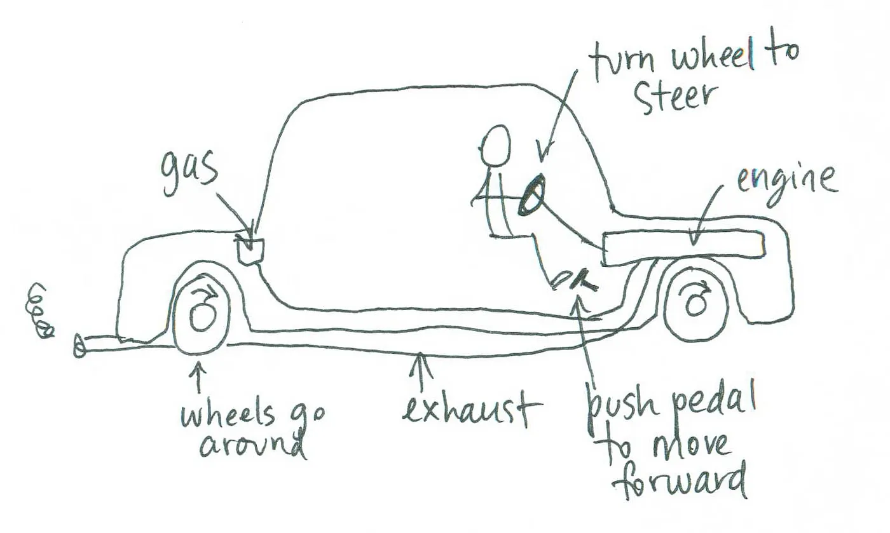

<!-- .slide: data-auto-animate -->
## housekeeping

feel free to address any human needs   *as they arise*

for the sake of my human needs,   *please limit sidebars* during the talk

held-hand system for answers,   open season for questions!

--- <!-- .slide: data-auto-animate -->

## introductions

Note:

--- <!-- .slide: data-auto-animate -->

## computing is an art

Note: Did you know that the founders of computing believed that programming, and computing at large, was too artistic to allow for scientific research?

+++ <!-- .slide: data-auto-animate -->

## computing is an art

[ACM publication policies and plans. Journal of the ACM 6 (Apr. 1959)]
<!-- .element: class="citation" -->

Note:
- make programming less of an artform.
- That was the fifties.
- our understanding of science and art, not mutually exclusive

+++ <!-- .slide: data-auto-animate -->

## computing is an art

> programmers who subconsciously view themselves
> as artists will enjoy what they do and
> will do it better.
<!-- .element: class="fragment good" data-fragment-index="1" -->

-- Donald Knuth, Author of "The Art of Programming"
<!-- .element: class="fragment citation" data-fragment-index="1" -->

Note:
- some disagree: practice disciplines as both arts and sciences.
- quote
- joy and improvement are not good motivations to embrace computing as art

--- <!-- .slide: data-auto-animate -->

## computing is an art

Note: In this talk, I want to add to this conversation around computing as an artform.

+++ <!-- .slide: data-auto-animate -->

## computing is the art   of making meaning

Note:
- philosophers in the room bristling
- I need your help in a moment
- first an outline of the talk.

--- <!-- .slide: data-auto-animate -->

#### outline

## of making meaning
<!-- .element: class="fragment" -->

#### interlude
<!-- .element: class="fragment" -->

## computing is the art   of making meaning

#### epilogue
<!-- .element: class="fragment" -->

#### bonus rounds!
<!-- .element: class="fragment" -->

Note:

--- <!-- .slide: data-auto-animate -->

## of making meaning

[What Computers Do, Doing With Computers:  
a philosophical field guide to computing in the world - Rawn 2023]
<!-- .element: class="fragment citation" data-fragment-index="1" -->

*discipline-agnostic, *I hope*
<!-- .element: class="fragment" -->

Note: We need to define what it is to “make meaning.” To do so, I will be drawing upon the centuries old philosophical school called “rationalism.” One of my fellow HCI researchers, Eric Rawn, wrote a fantastic queer history of rationalism, and I will be leaning on it in this section. One final note - I wrote this section to be discipline-agnostic. No matter your interests, if you will be making or interpreting meaning, I hope this section will be of use to you.

+++ <!-- .slide: data-auto-animate -->

## of making meaning

### abstractions
<!-- .element: class="fragment" -->

Note:So, how do we make meaning in rationalism?

+++ <!-- .slide: data-auto-animate -->

### abstractions

> The Way™️ of representing some  
> behavior in a particular context

abstractions direct our attention with
<!-- .element: class="fragment" data-fragment-index="1" -->

**abstraction blindness**
<!-- .element: class="fragment" data-fragment-index="1" -->

Note: In good philosophical style, we start with a couple definitions: an abstraction is The Way™ of representing some behavior within a particular context. Abstractions operate by directing our attention like blinders on a horse, highlighting some things and hiding others, so I will be calling the “highlighting and hiding” abstraction blindness.

+++ <!-- .slide: data-auto-animate -->

### abstractions
#### good example: steering wheel & pedals

  

    <b>representation</b>
    
gas

    
brake

    
steering wheel

  

  

    <b>action</b>
    
go

    
stop

    
turn the car

  

Note: Let’s have an example of a good abstraction: a car’s steering wheel and pedals. They represent the common actions in a car - stop, go, turn - making them abstractions for motion control. The pedals and the steering wheel are simple and independent; the abstractions that “gas means go,” “brake means stop,” and “turn the wheel to turn the car” almost rhyme in their simplicity. They direct our attention to the most interesting behaviors in a car in an intuitive way - a helpful highlighting.

+++ <!-- .slide: data-auto-animate -->

### abstractions
#### good example: steering wheel & pedals

[img credit - dave gray "mental model of a car"]
<!-- .element: class="citation" -->

<!-- .element: class="r-stretch" -->

Note: They also hide all the complex mechanics from us, all the machinery literally sealed away under the hood. No driver wants to think about the PSI of the brake pads or the exact flow rate of gas to the engine block - this is a helpful hiding. The controls even have great defaults that both hide and highlight - idle gas, no brakes, stop turning - making “doing nothing” mean “continue forward while gently slowing down.”

+++ <!-- .slide: data-auto-animate -->

### abstractions

good abstractions...
- mirror the structure of their context
<!-- .element: class="fragment" -->
- meaningfully limit actions in context
<!-- .element: class="fragment" -->

Note: I keep saying these are good abstractions, so a reasonable question is “What makes them good?” Good abstractions do two things: they mirror their context, and they meaningfully limit the space of actions within their context.

+++ <!-- .slide: data-auto-animate -->

### abstractions
#### good example: steering wheel & pedals

mirrors actions with *fine-grained control*

limits maximum acceleration,  minimum turn radius
<!-- .element: class="fragment" -->

Note: Back to the car, the pedals and wheel mirror the common actions and give us precise control over the intensity of acceleration or turning, while also putting strong limits on the extremes of control that match the maximum safe behavior while driving.

+++ <!-- .slide: data-auto-animate -->

### abstractions
#### good example: steering wheel & pedals

mirrors reality, adds limits with **feedback**:
- self-centering steering
<!-- .element: class="fragment" -->
- pedals with linear resistance
<!-- .element: class="fragment" -->

Note: What’s more, they mirror the effects of the outside world on the machine through tactile feedback. As the car pulls out of a turn, the tires head to center, and the steering wheel turns under your palms to reflect that. As you push the pedals harder and harder, the springs resist more and more, mimicking the diminishing returns of throttling the engine or clamping the brakes.

+++ <!-- .slide: data-auto-animate -->

### abstractions
#### evaluation

*context is key when evaluating abstractions*

Note: These are phenomenal abstractions, because they mirror their context and meaningfully limit your actions, and reinforce the limits and mirroring with feedback. Their goodness is directly tied to their relationship with context - imagine driving with a wii-mote and nunchuck. When it comes to designing and evaluating abstractions, context is key.

+++ <!-- .slide: data-auto-animate -->

### abstraction blindness

...directs your attention to places of interest...
<!-- .element: class="fragment" -->

> ...but what if it misdirects you?
<!-- .element: class="fragment bad" -->

Note: We’ve talked a lot about helpful blindness, what about harmful blindness? It turns out, even good abstractions have some harmful blindness.

+++ <!-- .slide: data-auto-animate -->

### abstraction blindness

the controls are independent,  
*but the underlying systems aren't!*
<!-- .element: class="fragment" -->

Note: Question - have you ever sat a kid in the driver’s seat? If you do, first make sure the car’s off. The first thing the kid will likely do is press both pedals at once. The independent motion of the pedals makes the child believe the systems are truly independent, but if the car was on, punching both pedals could do great damage both to the machine and the child. In this way, the blindness of “independent systems” - both hiding the mechanical details and highlighting independent controls, can become harmful.

+++ <!-- .slide: data-auto-animate -->

### abstraction blindness

<!-- .element: class="fragment" -->

Note: A reasonable follow-up question is “Why have them be independent if it could lead to harmful blindness? Why not link the pedals?” First and foremost, there are rare occasions when you want to press both, like waking up the entire neighborhood at 3AM. Second, simplicity is reliable - brake means stop and gas means go are stunningly simple abstractions because the pedals need to be extraordinarily reliable. Lastly, the context for the car’s controls is that an experienced driver is behind the wheel - someone who understands that the simplicity of the controls affords dangerous interactions, someone who is aware enough of the hidden mechanics under the hood not to accidentally do something dangerous - so that’s my driver’s license revoked.

+++ <!-- .slide: data-auto-animate -->

### abstraction blindness

reasons to have un-linked pedals:
- peeling out is "fun", apparently?*
- **simplicity is reliable**
- the context assumes an experienced driver

[*this is not legal or academic advice, it's joke, don't do this.]
<!-- .element: class="citation" -->

Note: Second, simplicity is reliable - brake means stop and gas means go are stunningly simple abstractions because the pedals need to be extraordinarily reliable. Lastly, the context for the car’s controls is that an experienced driver is behind the wheel - someone who understands that the simplicity of the controls affords dangerous interactions, someone who is aware enough of the hidden mechanics under the hood not to accidentally do something dangerous - so that’s my driver’s license revoked.

+++ <!-- .slide: data-auto-animate -->

### abstraction blindness

*directing attention is powerful & perilous*

> sometimes the abstraction's harm is  
> obscured by the abstraction's blindness
<!-- .element: class="fragment bad wide" -->

Note: To review, we use abstraction because it hides useless information, and highlights critical information. We call this abstraction blindness, and it is powerful, but perilous. There is always the potential for harmful blindness, or times when our attention is misdirected. This means that an abstraction can even direct our attention away from its own harmful effects (think of punching both pedals at once).

+++ <!-- .slide: data-auto-animate -->

### abstraction blindness

good thinkers...

- understand each abstraction's blindness...
<!-- .element: class="fragment" -->
- ...and expect weird interactions between them
<!-- .element: class="fragment" -->
- continually study their context, and revise
<!-- .element: class="fragment" -->
- double-check for harmful blindness
<!-- .element: class="fragment" -->
- triple-check: *go talk to a human*
<!-- .element: class="fragment" -->

Note: Good thinkers go to great lengths to avoid being blind to their own harms. They pick well-suited abstractions and are mindful of their blindness. They take care to predict how their  blind-spots could compose dangerously - think again of pressing two pedals at once. Responsible thinkers continuously check that their abstractions are still well-suited to their contexts, as contexts are often dynamic, and abstractions require updating to keep up. They always double-check how their abstractions blind them to human harm, and when in doubt, they go talk to the humans who may be suffering under their abstractions.

--- <!-- .slide: data-auto-animate -->

#### interlude

**multi-disciplinary study and abstraction**

wide study shows the history of our abstractions,  
and exposes us to new viewpoints
<!-- .element: class="fragment" -->

searching far and wide shows us   *how our abstractions evolve and change*
<!-- .element: class="fragment" -->

**this is why I love hci & cs education**
<!-- .element: class="fragment" -->

Note: An aside: mutli-disciplinary study is so important to critical thinking because it exposes you to so many abstractions. By drawing from many disciplines, you get to see how our abstractions evolve, break down, and are superseded with time. You are exposed to many different contexts and what kinds of abstractions are valuable in those contexts. And perhaps most importantly, it gives you a long history of the disasters due to harmful blindness going unchecked. This is why I love CS Education, and HCI at large - it gives me the freedom to explore many disciplines and learn from many mistakes. It makes me a stronger thinker.

+++ <!-- .slide: data-auto-animate -->

## computing is an art

Note: To recap - computing has always been an art...

+++ <!-- .slide: data-auto-animate -->

## of making meaning

### abstractions

### abstraction blindness

Note: we use abstractions to make meaning.

--- <!-- .slide: data-auto-animate -->

## computing is the art
## of making meaning

  <blockquote class="wide bad">???</blockquote>

  <blockquote class="wide">???</blockquote>

  <blockquote class="wide good">???</blockquote>

Note: So what do I mean when I say “computing is an art of making meaning?” I mean that when we do computing, particularly when we are programming, there are three audiences for which the abstractions we design must be comprehensible.

+++ <!-- .slide: data-auto-animate -->

### audience one

> the computer
<!-- .element: class="bad" -->

- incredible abilities
<!-- .element: class="fragment" -->
- strict requirements
<!-- .element: class="fragment" -->
- a total time-sink
<!-- .element: class="fragment" -->

Note: The first audience is the computer itself. The computer, as the custodian of the mechanical work we want done, has strict rules for what it is allowed to do, and you, as the author, must write programs that appease it. You will spend the most time in conversation with this audience, I promise you.

+++ <!-- .slide: data-auto-animate -->

### audience two

> the users
<!-- .element: class="" -->

- use your work to shape the world
<!-- .element: class="fragment" -->
- artists in their own right
<!-- .element: class="fragment" -->
- the most overlooked
<!-- .element: class="fragment" -->

Note: The second audience are your users - they must be able to pick up and comprehend your abstractions, and use them to manipulate the world around them. In this capacity, I like to say that you are a maker of brushes - a craftsperson who makes devices that are put to their own artistic ends. A huge concern in HCI is that we often spend too little time consulting our users, and too much consulting our machines.

+++ <!-- .slide: data-auto-animate -->

### audience three

> the developers
<!-- .element: class="good" -->

*look, it's you!*

Note: The third audience is you - the developers of the application. Not only do the abstractions exposed to the machine literally need to compute, and the abstractions exposed to the users need to be legible, but the abstractions that bind it all together need to make sense to those people with an inside view.

+++ <!-- .slide: data-auto-animate -->

### audience three

Note: Consider a car engine - it primarily interfaces with the outside world through the tires and gas tank, it interacts with the user through the clutch and gas pedals, and this is good - but it also must be sensible to the mechanics in the shop! The layout, the labeling, the manual, all of it was designed to be in line with the expectations of these workers.

+++ <!-- .slide: data-auto-animate -->

### audience three

Note: And unlike makers of physical machines, we programmers are unburdened by the terrible slowness of tangible reality. Our nuts and bolts are ideas in script, editable by simple keystroke. This speed and rapidity of editing makes us even more responsible for the legibility of our abstractions. We are charged with writing code that has three meanings, one for each audience, and unlike any other art, every audience must be appeased for your art piece to function properly. To do so requires a real skill, a real art.

+++ <!-- .slide: data-auto-animate -->

## computing is the art
## of making meaning

  <blockquote class="wide bad">computers</blockquote>

  <blockquote class="wide">users</blockquote>

  <blockquote class="wide good">developers</blockquote>

Note: What you need to understand is that all code is like this, and every computer runs on code. This means every computer is built upon unimaginably deep layers of abstraction, each with its own plurality of meanings and blindnesses. It is impossible to fully understand them all - there is no human alive that knows every abstraction that goes into a smartphone, let alone the cloud.

+++ <!-- .slide: data-auto-animate -->

## computing is the art
## of making meaning

Note: There is art in navigating these abstractions, even more so when they fail or break down, as they so often do. As artists, we are challenged to make sense of this world of fractal abstraction, or at least make enough sense of it to create responsibly. This is why I believe that computing is the art of making meaning - because there isn’t a more fraught or layered medium to test the mettle of our abstractions, and there’s no younger or more dynamic artform with the potential to influence so many audiences.

--- <!-- .slide: data-auto-animate -->

#### epilogue

we build meaning from abstractions, but...
<!-- .element: class="fragment" -->

> with abstraction, comes blindness.
<!-- .element: class="wide fragment good" -->

computing abstractions have three audiences, so...
<!-- .element: class="fragment" -->

> computing is the art of making meaning.
<!-- .element: class="wide fragment good" -->

Note: In conclusion, we build meaning out of abstraction. These abstractions come with their blindness, that’s why we use them, but if we are not careful to study our contexts and track our blindnesses, we can do great harm. In computing, everything is made of abstraction, and our abstraction must be comprehensible to three audiences - the author, the user, and the machine - and if any audience doesn’t comprehend your abstractions, they break. Therefore I claim that computing is the art of making meaning.

+++ <!-- .slide: data-auto-animate -->

#### epilogue

*so, where do **you** fit into all of this?*

all art has style, structure, and composition
<!-- .element: class="fragment" -->

computing has *so much* style
<!-- .element: class="fragment" -->

*I've spent my phd studying how to teach style*
<!-- .element: class="fragment" -->

Note: So, you may wonder, Serena, where do you fit in to all of this? Well, this art, like all others, has three pillars: style, structure, and composition. But because of the demands of our audiences, the art of computing is unique in that it is characterized by a preponderance of style. These styles were developed as skilled people all over the world found idioms that pleased all three audiences simultaneously. In a very human way, we have based our computer languages around easily expressing these idioms and styles. And it is the art of teaching style that I have spent my PhD studying, within the realm of HCI - bonus round topic!

+++ <!-- .slide: data-auto-animate -->

#### epilogue

*and where do **I** fit into all of this?*

wherever you like!
<!-- .element: class="fragment" -->

people had all kinds of advice for you...
<!-- .element: class="fragment" -->

bonus round topics!
<!-- .element: class="fragment" -->

Note: And where do you fit into all this? Well, nowhere, if you like, or right here beside me, if you’d rather. I surveyed a lot of people in preparation for this talk, both in and out of STEM. They said all kinds of things - but some particular anxieties kept surfacing. Those anxieties and their antidotes are more bonus round topics, but for now I feel the need to end my talk today with this.

*cs kickstart staff please help me, stand up for a moment

+++ <!-- .slide: data-auto-animate -->

#### some of my heros

Note: For generations, women in this field have worked to make it a more hospitable place. I wish I could tell you that this work is done, and the field is ready, or promise that you will not encounter hostile idiots with something to prove, but I can’t. What I can promise is this - the women standing up here, the CS Kickstart leaders and myself, take the ongoing work of making computing a home seriously, and we will support you if you call on us for help. And what’s more, research has shown that the best defense against hate of this kind is a community of peers, which means that the women sitting next to you are an even greater asset than the ones standing up here. Just by coming to CS Kickstart, each of you has already put yourself in a position to succeed. And for providing that gift of community, I want to give our CS Kickstart leaders a round of applause.

--- <!-- .slide: data-auto-animate -->

[bonus rounds, anyone?](https://docs.google.com/presentation/d/1XlGRr8MwTnJgvMHvZCDuMVAI1fFyFA1-nFge0DSgtSo/edit?usp=sharing)

Note: https://docs.google.com/presentation/d/1XlGRr8MwTnJgvMHvZCDuMVAI1fFyFA1-nFge0DSgtSo/edit?usp=sharing
