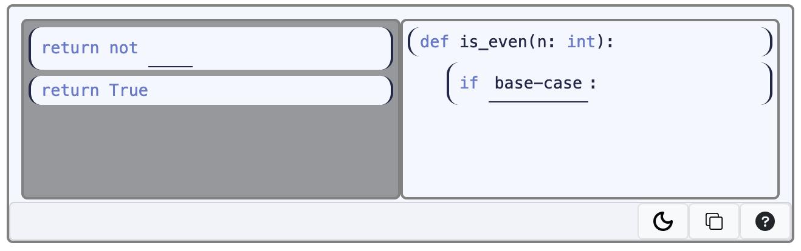
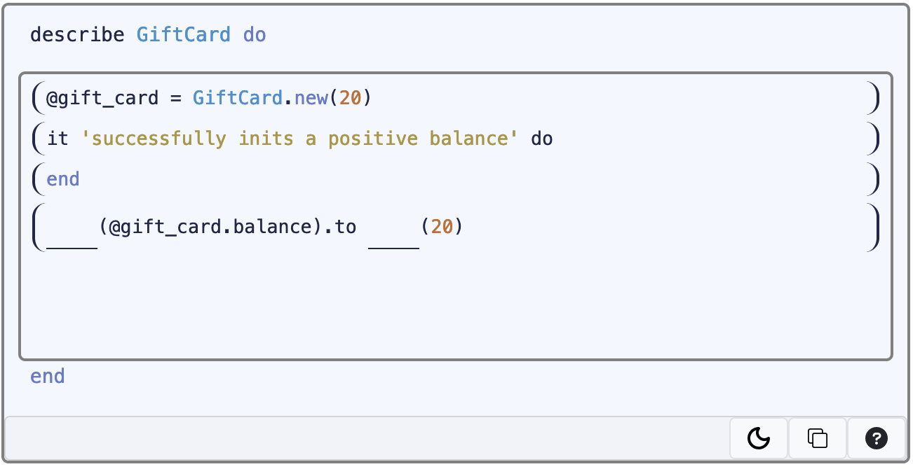
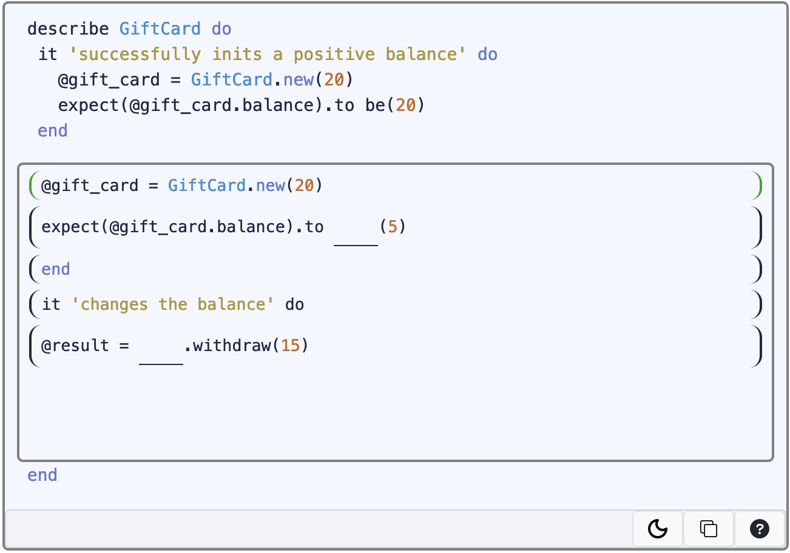
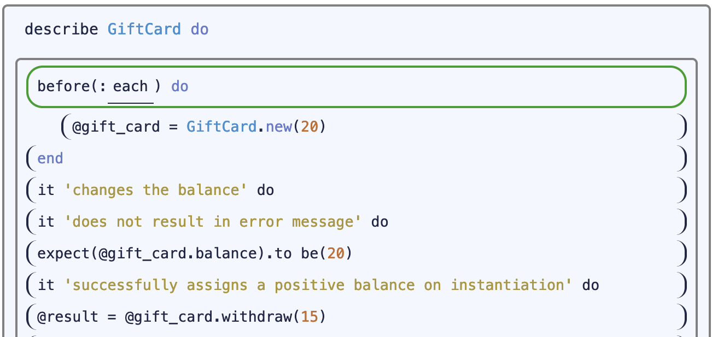
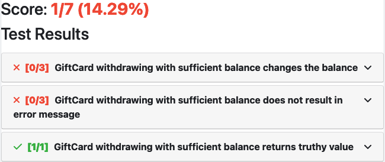
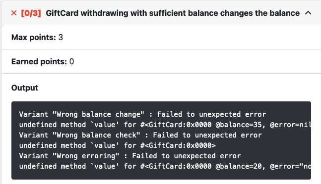

<!-- Feedback
 Lisa:
    Good habits quote *good*
    Conclusion slide colors and content **good**
    Feels like a research report
    Still unclear where we're going next
    Start with the Conclusion slide (as a roadmap)
    Generalize away from PrairieLearn
    Maybe cut down on code examples
    => your talk should quickly prime questions and adoption
 Narges:
    Highlight the process of how things are generated
    Sell us more on how this tool helps
    QR Code to paper
 Dan:
    Answer this fast and early:
        what is it, how do I use it, where do I get it.
    slide numbers
    you faced the screen a lot, face us
    clicker with laser rather than physical pointer since you may not be near the physical screen
    demo of fppgen?
    testing never taught in software engineering (huh?)
    are you trying to get us to adopt your tool?
    (from an instructor’s perspective) what’s in it for me?
 Nelson
    make it sparse
    shoot for way shorter than time, needs to include setup/tear-down

 Lots of slidespecs feedback:
    https://slidespecs.berkeley.edu/review/ZoBcQqr3665ReeWxw

 *don't take them on a journey without telling them where you're going*
 Fix the ending
 -->

## Automatic Generation of <br> Faded Parsons Problems
### (For Test Writing Problems and Beyond)
#### **Serena Caraco**, Nelson Lojo, <br> *Michael Verdicchio*, Armando Fox

Note: Prof Verdicchio in from Charelston, SC

--- <!-- .slide: data-auto-animate -->

### What's Exciting About Our Work?

*We know Faded Parsons impart good habits*
<!-- .element: class="fragment fade-in" -->

We want to impart strong Test-Writing
<!-- .element: class="fragment fade-in" -->

--- <!-- .slide: data-auto-animate -->

### What's **Challenging** About Our Work?

*We know Faded Parsons impart good habits*

> Old content is laborious to convert. <br>
> Writing from scratch can be worse.
<!-- .element: class="fragment bad" -->

We want to impart strong Test-Writing

> No coherent theory of "correctness" or  practical autograder
<!-- .element: class="fragment fade-in bad" -->


--- <!-- .slide: data-auto-animate -->
### Our Contributions

> **FPPgen** streamlines Authoring,<br>
> supports Arbitrary Complexity.
<!-- .element: class="fragment fade-in" -->

> **Mutation-Based Autograders** <br>
> assess Test Quality.
<!-- .element: class="fragment fade-in good" -->

*No matter the problem skill level or complexity, <br> our tools can help.*
<!-- .element: class="fragment fade-in" -->

--- <!-- .slide: data-auto-animate -->

### Roadmap

0. Faded Parsons Background
1. Authoring Experience
2. Assessing Test-Writing

---

### Part Zero
<hr>

## Background

--- <!-- .slide: data-auto-animate -->

> I am not a great programmer, <br>
> I am a good programmer <br>
> with great habits.

*Kent Beck*

*How do we impart good habits?*
<!-- .element: class="fragment fade-in" -->

--- <!-- .slide: data-auto-animate -->

*How do we impart good habits?*

### Faded Parsons Problems
<!-- .element: class="fragment fade-in" -->

+++ <!-- .slide: data-auto-animate -->

### Faded Parsons Problems
#### An Example



Note: Guiding idea: force expert solution reconstruction.

+++ <!-- .slide: data-auto-animate -->

### Faded Parsons Problems
#### Another Example


+++ <!-- .slide: data-auto-animate -->

### Faded Parsons Problems
*Do they work?*

- At least as effective as Code-Writing
<!-- .element: class="fragment fade-in" -->
- Designed for learning Good Habits
<!-- .element: class="fragment fade-in" -->
- Highly constrain the Solution Space
<!-- .element: class="fragment fade-in" -->

<p>&nbsp</p>

[Ericson '18, Zhi '19, Weinmann '20]
<!-- .element: class="demph" -->

Note: - Ericson FPP efficacy
- Zhi efficiency
- Weinmann ease of use, good habits

+++ <!-- .slide: data-auto-animate -->

*So how does any of this apply to writing test suites?*

*Let's follow an expert as they write a test suite...*
<!-- .element: class="fragment fade-in" -->

### An Expert Tests `Giftcard`

+++ <!-- .slide: data-auto-animate -->

### An Expert Tests `Giftcard`

``` rb [|1,2,5||3|4|5|]
describe 'Giftcard' do
    it 'changes the balance' do
        @gift_card = Giftcard.new(20)
        @result = @gift_card.withdraw(15)
        expect(@gift_card.balance).to eq(5)
    end
end
```

-  Tricky RSpec Syntax
<!-- .element: class="demph"-->
-  Arrange-Act-Assert Pattern
<!-- .element: class="demph" -->

+++ <!-- .slide: data-auto-animate -->

### An Expert Tests `Giftcard`

``` rb [|2,3,8,9,13,14|]
describe 'Giftcard' do
    it 'changes the balance' do
        @gift_card = Giftcard.new(20)
        @result = @gift_card.withdraw(15)
        expect(@gift_card.balance).to eq(5)
    end

    it 'successfully inits a positive balance' do
        @gift_card = Giftcard.new(20)
        expect(@gift_card.balance).to eq(20)
    end

    it 'does not result in error messages' do
        @gift_card = Giftcard.new(20)
        @result = @gift_card.withdraw(15)
        expect(@gift_card.error).to be_empty
    end
end
```

-  Tricky RSpec Syntax
<!-- .element: class="demph"-->
-  Arrange-Act-Assert Pattern
<!-- .element: class="demph" -->
-  File-length Solutions
<!-- .element: class="demph" -->

+++ <!-- .slide: data-auto-animate -->

### An Expert Tests `Giftcard`

``` rb [|2-4|]
describe 'Giftcard' do
    before(:each) do
        @gift_card = Giftcard.new(20)
    end

    it 'changes the balance' do
        @result = @gift_card.withdraw(15)
        expect(@gift_card.balance).to eq(5)
    end

    it 'successfully assigns a positive balance on instantiation' do
        expect(@gift_card.balance).to eq(20)
    end

    it 'does not result in error messages' do
        @result = @gift_card.withdraw(15)
        expect(@gift_card.error).to be_empty
    end
end
```

-  Tricky RSpec Syntax
<!-- .element: class="demph"-->
-  Arrange-Act-Assert Pattern
<!-- .element: class="demph" -->
-  File-length Solutions
<!-- .element: class="demph" -->
-  Use DRY Style
<!-- .element: class="demph" -->


+++ <!-- .slide: data-auto-animate -->

### Student Difficulties with Test Writing

-  Tricky RSpec Syntax
<!-- .element: class="demph"-->
-  Arrange-Act-Assert Pattern
<!-- .element: class="demph" -->
-  File-length Solutions
<!-- .element: class="demph" -->
-  Use DRY Style
<!-- .element: class="demph" -->

*Imparting style? Scaffolding syntax? Unweildy solutions?*
<!-- .element: class="fragment fade-in demph" -->

> Faded Parsons Problems!
<!-- .element: class="fragment fade-in good" -->

+++ <!-- .slide: data-auto-animate -->
## Motivation

*So we started writing new content...*

> Faded Parsons Problems work here, <br> but are difficult to author.
<!-- .element: class="fragment fade-in bad" -->

> Existing Spec-Based Autograders <br> fail practically and theoretically.
<!-- .element: class="fragment fade-in bad" -->

Note: bring scaffolding, grading, habits

---

### Part One
<hr>

## Authoring Experience

Note: we diverge from previous work here.

+++ <!-- .slide: data-auto-animate -->

### Authoring From Scratch

First, a recap of authoring Code-Writing problems.
<!-- .element: class="fragment fade-in" -->


+++ <!-- .slide: data-auto-animate -->
### Code-Writing From Scratch

1. Spin-up PrairieLearn
2. Generate Templates
3. Edit info.json
4. Update server.py
5. Write your prompt (HTML)
6. Format your question (XML)
7. Write your solution (BYOL)
8. Write your spec

+++

### Faded Parsons From Scratch

1. Write your prompt
2. Write your solution
3. Write your spec
4. Run **FPPgen**

**Minimal Overhead**
<!-- .element: class="fragment fade-in" -->

Note: - no longer blocking on PrairieLearn, but still need it
- human readable output
- prompt embellishment, reference solution presentation.

+++ <!-- .slide: data-auto-animate -->

*Well, what about...*

### Conversion from Code-Writing

+++ <!-- .slide: data-auto-animate -->
### Conversion from Code-Writing

1. Start with your Code-Writing Solution
2. Mark
<!-- .element: class="fragment fade-in" -->
`?Blanks?`
3. Run FPPgen
<!-- .element: class="fragment fade-in" -->

**Done.**
<!-- .element: class="fragment fade-in" -->

Note: win-win

---

### Part Two
<hr>

## Assessing Test-Writing

--- <!-- .slide: data-auto-animate -->

### Common Misconception

> While useful for beginners, <br>
> FPPs are an impractical medium
> for teaching software engineering.
<!-- .element: class="bad" -->

I'll do you one better.
<!-- .element: class="fragment fade-in" -->

--- <!-- .slide: data-auto-animate -->

### Test Writing

#### Difficult to Scaffold
<!-- .element: class="fragment fade-in" -->
#### Even Harder to Grade.
<!-- .element: class="fragment fade-in" -->

+++ <!-- .slide: data-auto-animate -->

*How do we scaffold and constrain solution space?*

*How do we impart good habits?*
<!-- .element: class="fragment fade-in" -->
### Faded Parsons Problems <span class="fragment fade-in">++</span>
<!-- .element: class="fragment fade-in" -->

Note: narrows solution space while scaffolding!

+++ <!-- .slide: data-auto-animate -->

#### Single-Tray Problems with Context



+++ <!-- .slide: data-auto-animate -->

#### Multi-Part Faded Parsons


<div class="col-container">
    <div class="col">
        
        <h4 class="fragment fade-in">. . . Solved!</h4>
    </div>
    <div class="col">
        
    </div>
</div>

+++ <!-- .slide: data-auto-animate -->

#### Mutli-Part Faded Parsons


<div class="col-container">
    <div class="col">
        
        <h4 class="fragment fade-in">. . . Solved!</h4>
    </div>
    <div class="col">
        
    </div>
</div>

+++ <!-- .slide: data-auto-animate -->

#### Mutli-Part Faded Parsons


<div class="col-container">
    <div class="col">
        
    </div>
    <div class="col">
        
    </div>
    <div class="col">
        
    </div>
</div>

+++ <!-- .slide: data-auto-animate -->

#### Mutli-Part Faded Parsons


<!-- .element: class="taper-fade" -->

--- <!-- .slide: data-auto-animate -->
### Test Writing

#### Difficult to Scaffold
> Multi-Part Faded Parsons
<!-- .element: class="fragment fade-in good" -->
#### Even Harder to Grade.

--- <!-- .slide: data-auto-animate -->
### Aside: Spec-Based Autograder

<div class="col-container">
    <div class="col">
        <h4>From Instructor</h4>
        <p class="col fragment fade-in">Reference Solution</p>
        <p class="col fragment fade-in">Test Inputs</p>
    </div>
    <div class="col">
        <h4>From Student</h4>
        <p class="col">&nbsp</p>
        <p class="col">&nbsp</p>
        <p class="col fragment fade-in">Student Solution</p>
    </div>
    <div class="col">
        <h4>At Grading</h4>
        <hr class="invis"></hr>
        <p class="col fragment fade-in" style="text-align: left;">$\big \}~~$ Reference Output</p>
        <p class="col fragment fade-in" style="text-align: left;">$\big \}~~~~$ Student Output</p>
        <hr class="invis"></hr>
        <hr class="col fragment fade-in">
        <p class="col fragment fade-in"><b>Score</b></p>
    </div>
</div>


--- <!-- .slide: data-auto-animate -->
### Assessing Test Suites

#### Problem Components:
<!-- .element: class="fragment fade-in" -->
- A System Under Test that we provide
<!-- .element: class="fragment fade-in" -->
- A Test Suite that
<!-- .element: class="fragment fade-in" -->
*we want to grade*

> Spec-Based Autograding fails <br>
> in practice and in theory.
<!-- .element: class="fragment fade-in" -->

Note: arbitrary SUT dependencies! arbitrary test deps!

+++ <!-- .slide: data-auto-animate -->
### Assessing Test Suites
- A System Under Test that we provide
- A Test Suite that *we want to grade*
- A Set of Mutants we create
<!-- .element: class="fragment fade-in" data-fragment-index="2" -->

Borrow Mutant Generation from Industry QA

Make a *Mutation-Based Autograder* that <br>
grades a test suite on killed mutants
<!-- .element: class="fragment fade-in" data-fragment-index="1" -->

+++ <!-- .slide: data-auto-animate -->

### Mutation-Based Autograders

<div class="col-container">
    <div class="col" style="flex: 1 1 0">
        <h4>From Instructor</h4>
        <p class="col">Ref. Solution</p>
        <p class="col">System Under Test</p>
        <p class="col">Mutations</p>
    </div>
    <div class="col" style="flex: 1 1 0">
        <h4>From Student</h4>
        <p class="col">&nbsp</p>
        <p class="col">&nbsp</p>
        <p class="col">&nbsp</p>
        <p class="col">Stud. Solution</p>
    </div>
    <div class="col" style="flex: 2 1 0">
        <h4>At Grading</h4>
        <div class="col-container">
            <div class="col">
                <p class="col">&nbsp</p>
                <p class="col fragment fade-in">$\bigg \}$ Mutants</p>
            </div>
            <div class="col">
                <p class="col fragment fade-in" style="text-align: left;">$\bigg \}~~$ Reference Output</p>
                <hr style="color:#00000000"></hr>
                <p class="col fragment fade-in" style="text-align: left;">$\bigg \}~~~~$ Student Output</p>
                <hr class="col fragment fade-in">
                <p class="col fragment fade-in"><b>Score</b></p>
            </div>
        </div>
    </div>
</div>

Note: - Only one mutation set for all parts.
- This scheme does not require FPPs

--- <!-- .slide: data-auto-animate -->

### Mutation-Based Autograders
#### Sample Feedback



+++ <!-- .slide: data-auto-animate -->

### Mutation-Based Autograders
#### Sample Feedback


+++ <!-- .slide: data-auto-animate -->

### Mutation-Based Autograders
#### Sample Feedback



--- <!-- .slide: data-auto-animate -->
### Test Writing

#### Difficult to Scaffold
> Multi-Part Faded Parsons
<!-- .element: class="fragment fade-in good" -->
#### Even Harder to Grade.
> Mutation-Based Autograder
<!-- .element: class="fragment fade-in good" -->

*What about authoring these...*
<!-- .element: class="fragment fade-in" -->

---

### Future Work

- Continue to improve the Authoring UX
<!-- .element: class="fragment fade-in" data-fragment-index="1" -->
  - Streamline Multi-Part Problems
<!-- .element: class="fragment fade-in" data-fragment-index="1" -->
  - Automate Mutant Generation
<!-- .element: class="fragment fade-in" data-fragment-index="1" -->
- Study efficacy specific to Test Writing
<!-- .element: class="fragment fade-in" -->
- Use FPPs in more upper division topics
<!-- .element: class="fragment fade-in" -->

--- <!-- .slide: data-auto-animate -->
### Conclusion

> **FPPgen** streamlines Authoring,<br>
> supports Arbitrary Complexity.
<!-- .element: class="fragment fade-in" -->

> **Mutation-Based Autograders** <br>
> assess Test Quality.
<!-- .element: class="fragment fade-in good" -->

*No matter the problem skill level or complexity, <br> our tools can help.*
<!-- .element: class="fragment fade-in" -->
