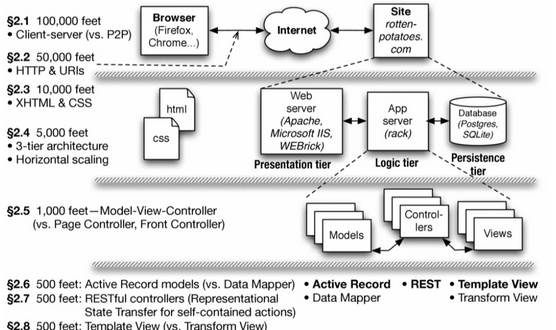

<!-- .slide: data-auto-animate -->

### Warm-Up Rounds
<div class="col-container">
<div class="col text-left small" style="margin-right: 20px">
  Which of these is a block?
  <ol style="list-style-type: upper-alpha">
    <li><pre>:+</pre></li>
    <li><pre>{ puts 'hi' }</pre></li>
    <li><pre>get '/products', to: 'products#index'</pre></li>
  </ol>

  Which of the following are true of internet protocols?
  <ol style="list-style-type: upper-alpha">
  <li>TCP requires content to be XML</li>
  <li>IP address are made of 4 bytes</li>
  <li>Rails is the standard for displaying webpages</li>
  </ol>
</div>
<div class="col text-left small">
  Why is POST the right verb for triggering a behavior?
  <ol style="list-style-type: upper-alpha">
    <li>GET is used to get results</li>
    <li>POST is the only non-idempotent verb</li>
    <li>RUN is a non-standard verb, so it's unused</li>
  </ol>

  Which of the following are defining features of RESTful APIs?
  <ol style="list-style-type: upper-alpha">
    <li>allowing only functionally-pure operations</li>
    <li>use of only idempotent actions</li>
    <li>fully-specifying behaviors in one route</li>
  </ol>
</div>
</div>

+++ <!-- .slide: data-auto-animate -->

### Warm-Up Rounds
<div class="col-container">
<div class="col text-left small" style="margin-right: 20px">
  Which of these is a block?
  <ol style="list-style-type: upper-alpha">
    <li class="bold"><pre>:+</pre></li>
    <li><pre>{ puts 'hi' }</pre></li>
    <li><pre>get '/products', to: 'products#index'</pre></li>
  </ol>

  Which of the following are true of internet protocols?
  <ol style="list-style-type: upper-alpha">
  <li>TCP requires content to be XML</li>
  <li class="bold">IP address are made of 4 bytes</li>
  <li>Rails is the standard for displaying webpages</li>
  </ol>
</div>
<div class="col text-left small">
  Why is POST the right verb for triggering a behavior?
  <ol style="list-style-type: upper-alpha">
    <li>GET is used to get results</li>
    <li class="bold">POST is the only non-idempotent verb</li>
    <li>RUN is a non-standard verb, so it's unused</li>
  </ol>

  Which of the following are defining features of RESTful APIs?
  <ol style="list-style-type: upper-alpha">
    <li>allowing only functionally-pure operations</li>
    <li>use of only idempotent actions</li>
    <li class="bold">fully-specifying behaviors in one route</li>
  </ol>
</div>
</div>


--- <!-- .slide: data-auto-animate -->
# Module 4 Discussion
<!-- .element: class="r-fit-text" -->
## Routes, MVC & Rails

<br>

*adapted from Adam Lew Dong's slides -- thanks Adam!*
<!-- .element: class="citation" -->

--- <!-- .slide: data-auto-animate -->

## Basic MVC & Routes

+++ <!-- .slide: data-auto-animate -->
### Routes
*what are the verbs?*
- show me box a
- set box a to have name = Jane and color = blue
- update box a to have name = Nell
- make a box with name = Tina and color = red

--- <!-- .slide: data-auto-animate -->
### Routes

*what are the __routes__?*
<!-- .element: class="fragment" -->

- show me box a
- **GET**
- set box a to have name = Jane and color = blue
- **PUT**
- update box a to have name = Nell
- **PATCH**
- make a box with name = Tina and color = red
- **POST**

+++ <!-- .slide: data-auto-animate -->
### Routes

- show me box a
- **GET** `/box/a`
- set box a to have name = Jane and color = blue
- **PUT** `/box/a`
- update box a to have name = Nell
- **PATCH** `/box/a`
- make a box with name = Tina and color = red
- **POST** `/box`

+++ <!-- .slide: data-auto-animate -->

### Controller Actions

- create
- update
- show
- destroy

+++ <!-- .slide: data-auto-animate -->

### Controller Actions

- new
- create
- edit
- update
- index
- show
- destroy

+++ <!-- .slide: data-auto-animate -->
###  Actions

- show me box a
- **GET** `/box/a` `Box#show`
- set box a to have name = Jane and color = blue
- **PUT** `/box/a` `Box#create`
- update box a to have name = Nell
- **PATCH** `/box/a` `Box#update`
- make a box with name = Tina and color = red
- **POST** `/box` `Box#update`

--- <!-- .slide: data-auto-animate -->


## MVC



*reminder: we are here (2.5)*
<!-- .element: class="small" -->

+++ <!-- .slide: data-auto-animate -->
## MVC

<div class="col-container">
<div class="col">
  <h4>Model</h4>

  all about the data:
  storage, representation
</div>
<div class="col">
  <h4>View</h4>

  the way we display data <br>
  (user-facing UI)
</div>
<div class="col">
  <h4>Controller</h4>

  how we handle UI events and <br>
  deliver data to renderer
</div>
</div>

*your app will have many MVCs!*

+++ <!-- .slide: data-auto-animate -->

### MVC in Elm

**don't memorize syntax, look for patterns!**


+++ <!-- .slide: data-auto-animate -->
### MVC in Elm

```elm [|8-19|22-29|32-43|46-52]
module Main exposing (..)

import Browser
import Html exposing (..)
import Html.Events exposing (onClick)


type alias Model =
    { count : Int }


init : Model
init =
    { count = 10 }


type Msg
    = Increment
    | Decrement


controller : Msg -> Model -> Model
controller msg model =
    case msg of
        Increment ->
            { count = model.count + 1 }

        Decrement ->
            { count = model.count - 1 }


view : Model -> Html Msg
view model =
    div []
        [ h1 [] [ text "Your Number is:" ]
        , div []
            [ button [ onClick Decrement ] [ text "-" ]
            , span [] [ text "  " ]
            , em [] [ text (String.fromInt model.count) ]
            , span [] [ text "  " ]
            , button [ onClick Increment ] [ text "+" ]
            ]
        ]


main : Program () Model Msg
main =
    Browser.sandbox
        { init = init
        , update = controller
        , view = view
        }

```

+++ <!-- .slide: data-auto-animate -->

### MVC in Elm

*what does this look like?*

+++ <!-- .slide: data-auto-animate -->

### MVC in Elm


*what would change:*

>  Model? &nbsp; View? &nbsp; Controller? &nbsp; Msg?
<!-- .element: class="wide" -->

*where would logic for preventing $count < 0$ go?*

*how about restyling buttons conditionally?*
<!-- .element: class="fragment" -->

*what about setting the text field directly?*
<!-- .element: class="fragment" -->
+++ <!-- .slide: data-auto-animate -->

### MVC in Elm


*but serena, \*technically,\* Elm is MVU not MVC.*

``` elm [5]
main : Program () Model Msg
main =
    Browser.sandbox
        { init = init
        , update = controller
        , view = view
        }
```

b/c in elm, nothing is mutable, apps are small, and everything is frontend, <br> we don't care too much about "view over-reach"
<!-- .element: class="small" -->

+++ <!-- .slide: data-auto-animate -->

### MVC in Elm

*why show this? look at our types:*

``` elm
type Msg
    = Increment
    | Decrement

type alias Model =
  { count : Int }

view : Model -> Html Msg

controller : Msg -> (Model -> Model)
```

- `model` is like our db schemas
- `view` displays info nicely w/o complex logic
- `controller` has business logic, <br> responds to requests
