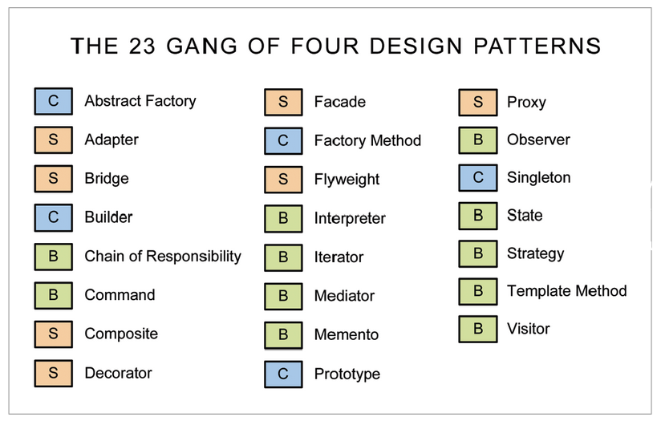
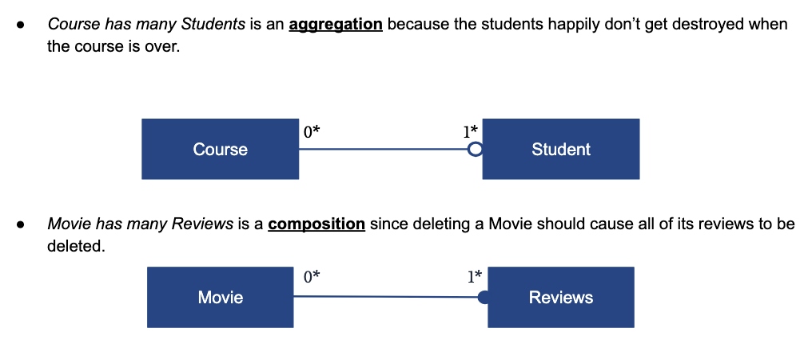

<!-- .slide: data-auto-animate -->

### Module 9 Discussion
### Design Patterns & Refactoring
<!-- .element: class="r-fit-text" -->

*thanks to Paul Woo for slide inspiration*
<!-- .element: class="small" -->

--- <!-- .slide: data-auto-animate -->

### Design Patterns

*common structures to solve classes of problems*

+++ <!-- .slide: data-auto-animate -->

### Design Patterns

*common structures to solve classes of problems*

- reusable structure/behavior/strat/technique
- addresses families of similar problems
- separates unchanging features
- fulfills concise/DRY principles

+++ <!-- .slide: data-auto-animate -->

### Design Patterns

*common structures to solve classes of problems*

"Gang of Four" wrote an influential textbook in '94 on design patterns, suggesting:

- composition/delegation over inheritance
- program to an interface, not an impl

+++ <!-- .slide: data-auto-animate -->

### Design Patterns

*common structures to solve classes of problems*

GoF identifies 23 patterns across 3 categories

- creational: all about object creation
- structural: class composition/inheritance
- behavioral: communication between objects

+++ <!-- .slide: data-auto-animate -->

### Design Patterns



*creational, structural, behavioral*
<!-- .element: class="citation" -->

+++ <!-- .slide: data-auto-animate -->

### Design Patterns
#### Particularly Important Patterns

- factory: a method for constructing valid objects
- abstract factory: a class of related factories
- composite: related classes form a tree, client interacts with the root only
- decorator: dynamically adds behavior by wrapping a method/class

+++ <!-- .slide: data-auto-animate -->

### Design Patterns
#### Particularly Important Patterns

*creational, structural, or behavioral?*

- factory: *creational*
<!-- .element: class="fragment" -->
- abstract factory: *creational*
<!-- .element: class="fragment" -->
- composite: *structural*
<!-- .element: class="fragment" -->
- decorator: *structural*
<!-- .element: class="fragment" -->

+++ <!-- .slide: data-auto-animate -->

### Design Patterns
#### Patterns You May Have Seen Before

- interpreter: defines formal grammar and rules to interpret a language
- iterator: provides sequential access to a collection's items
- singleton: ensures only one instance of a class exists at any time
- proxy: provides a surrogate for another object to control access to it

+++ <!-- .slide: data-auto-animate -->

### Design Patterns
#### Patterns You May Have Seen Before

*which of these is **not** a behavioral pattern?*

- interpreter
- iterator
- singleton
- proxy

+++ <!-- .slide: data-auto-animate -->

### Design Patterns
#### Patterns You May Have Seen Before

*which of these is **not** a behavioral pattern?*

- interpreter
- iterator
- **singleton**
- proxy

--- <!-- .slide: data-auto-animate -->

#### Bonus:
### A Short Critique of the GoF 23

*a lot of the 23 are workarounds for C++'s failings*

*note: this section is out-of-scope for quizzes*
<!-- .element: class="citation" -->

+++ <!-- .slide: data-auto-animate -->

### A Short Critique of the GoF 23

*note how OO centric it is, everything's an object...*

- principles directly diss inheritance *(good.)*
- "[the 23] turns you into a human compiler."
- modern declarative styles eliminate a bunch of these problems by actually compiling them

*quote by Paul Graham*
<!-- .element: class="citation" -->

+++ <!-- .slide: data-auto-animate -->

### A Short Critique of the GoF 23

*there's already a lot, but wait, there's more*

in '05, the GoF themselves wanted to add more:
- dependency injection
- extension interfaces
- type objects
- the null (default) object

*not to mention a whole new "Concurrency" category (though not from GoF)*
<!-- .element: class="citation" -->

+++ <!-- .slide: data-auto-animate -->

### A Short Critique of the GoF 23

*so maybe we change paradigms?*

- AOP tackles some problems more elegantly <br> (see LISP, Elixir, Rails)
- FP eliminates many such problems entirely <br> (eg Factory, Decorator, Flyweight, State)

+++ <!-- .slide: data-auto-animate -->

### A Short Critique of the GoF 23

*or maybe we elevate patterns into OO lang features!*

- Scala's singleton `object`
- Rust's, Java's, ... `iter`ator interfaces
- Zig's, Swift's `defer` or Python's `with`
- Python's `@` decorator system
- Go, Rust dropping inheritance entirely*

*\*wait, no inheritance? is that still OO? why (not)?*
<!-- .element: class="fragment citation" -->

+++ <!-- .slide: data-auto-animate -->

### A Short Critique of the GoF 23

*all this to say, the 23 aren't perfect, but...*

- for OO langs (most of prod), you need 'em
- GoF terms standardized the vernacular
- as language designers wise-up, modern langs are promoting patterns into first-class features!

--- <!-- .slide: data-auto-animate -->

### Design Anti-Patterns

*signs of common failures to solve problems*

+++ <!-- .slide: data-auto-animate -->

### Design Anti-Patterns
#### Code Smells

- warn of problems *within methods* of a class
- fixes are usually contained to the class itself
- detection and fix guidelines bundled in SOFA!

+++ <!-- .slide: data-auto-animate -->

### Design Anti-Patterns

*"SOFA" says methods should be*

- Short
- One-purpose
- Few-arguments
- (consistently) Abstract

*okay so the grammar isn't grammaring, sue me.*
<!-- .element: class="citation" -->

+++ <!-- .slide: data-auto-animate -->

*Short*

```rb
class Rectangle
  def update_bounds
    @width = calculate_width_from_coords(@x1, @x2)
    @height = calculate_height_from_coords(@y1, @y2)
    validate_positive_dimensions
    check_canvas_boundaries
    log_dimension_changes
    update_area_cache
    notify_observers
    recalculate_diagonal
    update_bounding_box
    refresh_display
    save_to_history
    trigger_rerender
  end
end
```

+++ <!-- .slide: data-auto-animate -->

*Short*

```rb [2-8|10-19]
class Rectangle
  def update_bounds
    @width = calculate_width_from_coords(@x1, @x2)
    @height = calculate_height_from_coords(@y1, @y2)
    log_dimension_changes
    validate_and_save
    notify_observers
  end
  private
  def validate_and_save
    validate_positive_dimensions
    check_canvas_boundaries
    update_area_cache
    recalculate_diagonal
    update_bounding_box
    refresh_display
    save_to_history
    trigger_rerender
  end
end
```

*shorter and more reusable methods!*
<!-- .element: class="citation" -->

+++ <!-- .slide: data-auto-animate -->

*One Purpose*

```rb
class Movie
  def add_review(review)
    @reviews << review
    @average_rating = calculate_average
    send_email_notification!(review.user)
    update_recommendation_engine
    post_to_social_media!(review.text) if review.rating >= 4
  end
end
```

+++ <!-- .slide: data-auto-animate -->

*One Purpose*

```rb
class Movie
  def add_review(review)
    @reviews << review
    @average_rating = calculate_average
    update_recommendation_engine
  end
  def publicize_review!(review)
    raise ArgumentError if review.rating < 4
    send_email_notification!(review.user)
    post_to_social_media!(review.text)
  end
end
```

+++ <!-- .slide: data-auto-animate -->

*Few Arguments*

```rb
class Rectangle
  def draw(bound_x, bound_y, bound_width, bound_height, z_index,
         color, border_width, border_color, fill_pattern,
         opacity, rotation, shadow_x, shadow_y)
    # ...
  end
end
```

*few-arguments little brother: <br> many arguments with a shared prefix*
<!-- .element: class="citation" -->

+++ <!-- .slide: data-auto-animate -->

*Few Arguments*

```rb
class Rectangle
  def draw(bound_rect, style)
    # ...
  end
end
# oftentimes, few args spawns new structs!
class Bounds
  attr_reader :x, :y, :width, :height, :z_index
end
class Style
  attr_reader :color, :rotation
  attr_reader :border_width, :border_color
  attr_reader :fill_pattern, :opacity, :shadow_rect
end
```

+++ <!-- .slide: data-auto-animate -->

*(Consistently) Abstract*

```rb
class Movie
  def generate_report
    calculate_statistics
    format_review_summary
    File.open("report.txt", "w") do |f|
      f.write! @summary
    end
    system("chmod 644 report.txt")
  end
end
```

+++ <!-- .slide: data-auto-animate -->

*(Consistently) Abstract*

```rb
class Movie
  def generate_report
    calculate_statistics
    format_review_summary
    write_summary_file!
  end
  private
  def write_summary_file!
    File.open("report.txt", "w") do |f|
      f.write! @summary
    end
    system("chmod 644 report.txt")
  end
end
```

*see how ruby enforces this at-a-glance: <br> a near-pseudocode method, a near-bash method
<!-- .element: class="citation" -->

+++ <!-- .slide: data-auto-animate -->

### Design Anti-Patterns

*"SOFA" says methods should be*

- Short
- One-purpose
- Few-arguments
- (consistently) Abstract

+++ <!-- .slide: data-auto-animate -->

### Design Anti-Patterns
#### Design Smells

- warn of problems across methods/classes
- fixes are usually in class relationships
- detection and fix guidelines bundled in SOLID

+++ <!-- .slide: data-auto-animate -->

### Design Anti-Patterns

*"SOLID" says classes should be*

- Single responsibility

*a class should have one clear purpose*


+++ <!-- .slide: data-auto-animate -->

### Design Anti-Patterns

*"SOLID" says classes should be*

- Single responsibility
- Open to extension, closed to modification

*as in ruby: adding is ok, overwriting is not\**

*\*though ruby does have ways around this limitation*
<!-- .element: class="citation" -->

+++ <!-- .slide: data-auto-animate -->

### Design Anti-Patterns

*"SOLID" says classes should be*

- Single responsibility
- Open to extension, closed to modification
- Liskov substitution principle compliant

*"objects of a superclass should be replaceable by objects of its subclasses without affecting the program's correctness"*

+++ <!-- .slide: data-auto-animate -->

### Design Anti-Patterns

*"SOLID" says classes should be*

- Single responsibility
- Open to extension, closed to modification
- Liskov substitution principle compliant
- Injected with dependencies at runtime

*this is just ruby's mixin system! <br> important for generating seams in testing*

+++ <!-- .slide: data-auto-animate -->

### Design Anti-Patterns

*"SOLID" says classes should be*

- Single responsibility
- Open to extension, closed to modification
- Liskov substitution principle compliant
- Injected with dependencies at runtime
- Demeter principle compliant

*"I deal only with my direct friends, <br> never friends of friends."*

+++ <!-- .slide: data-auto-animate -->

### Design Anti-Patterns

*"SOLID" says classes should be*

- Single responsibility
- Open to extension, closed to modification
- Liskov substitution principle compliant
- Injected with dependencies at runtime
- Demeter principle compliant

*"I deal only with my direct friends, <br> never friends of friends."*

+++ <!-- .slide: data-auto-animate -->

### Design Anti-Patterns

For examples, [read paul's slides!](https://docs.google.com/presentation/d/124Avl75OLSdJImLErEBL1QIz-vY_67FV/edit?usp=sharing&ouid=107163727272916485034&rtpof=true&sd=true)

*lots of testable content covered here! <br> please do read it!*

--- <!-- .slide: data-auto-animate -->

### What About P&D?

*won't someone think of poor old plan-and-document?*

+++ <!-- .slide: data-auto-animate -->

### What About P&D?
*remember: emphasis on thorough planning!*

the design phase makes extensive use of patterns

will start with design patterns <br> and cross over to architectural

+++ <!-- .slide: data-auto-animate -->

### What About P&D?

*maintenance phase (and refactoring) comes last!*

reliability is usually achieved through <br> hardware redundancy

dependability is hollistic, measured in <br> *mean time to failure*

+++ <!-- .slide: data-auto-animate -->

### What About P&D?

*security is often post-hoc*

a "tiger team" does basic in-house white-hat, eg:
- buffer overflows
- arithmetic overflows
- data race attacks

referred to as "penetration tests," <br> i.e. how deep in the system can we go

+++ <!-- .slide: data-auto-animate -->

### What About P&D?
#### Common Pitfalls

- over/under-reliance on patterns in phase one
- over-reliance on UML or other diagrams
- dismissing SOLID principles during refactors
- lots of private methods in a class
- using awkward factory patterns

+++ <!-- .slide: data-auto-animate -->

### What About P&D?
#### Recap

- little talk of perf except in the system reqs, later
validated in the "Master Test Plan"
- releases are part of "configuration management," wrap up everything about the project at that time, including docs
- redundancy is key for dependability, measured with MTTF
- unlike probabilistic models used elsewhere, security is run by intelligent "adversaries"


--- <!-- .slide: data-auto-animate -->

### UML Diagrams

*a brief recap*

+++ <!-- .slide: data-auto-animate -->

### UML Diagrams

*graphical representation of your app*
- boxes are classes, labelled with critical methods
- lines are collored `belongs/has` relations*, ends labelled with multiplicity (`*, 0*, 1, 1*`)

*\*aka Composition/Aggregation*
<!-- .element: class="citation" -->

+++ <!-- .slide: data-auto-animate -->

### UML Diagrams



--- <!-- .slide: data-auto-animate -->

### Recap

+++ <!-- .slide: data-auto-animate -->

### Recap

- common design patterns & anti-patterns
- code smells $\implies$ SOFA
- design smells $\implies$ SOLID
- P&D comes with its own challenges
- UML exists to help plan architectures
