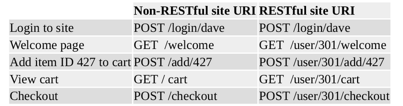
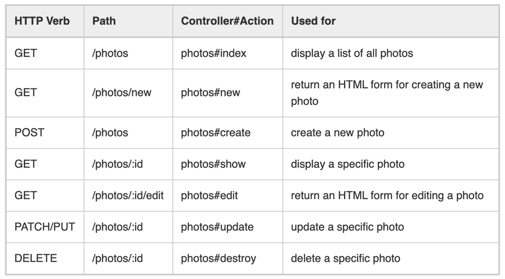
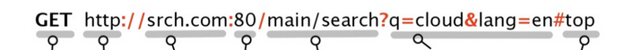
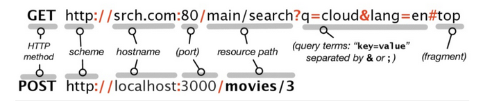
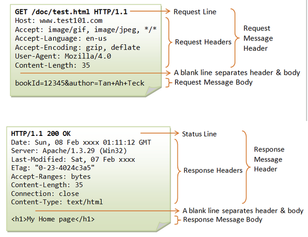

<!-- .slide: data-auto-animate -->

### Warm-Up Rounds
<div class="col-container">
<div class="col text-left small" style="margin-right: 20px">
  Which of these is a block?
  <ol style="list-style-type: upper-alpha">
    <li><pre>:+</pre></li>
    <li><pre>{ puts 'hi' }</pre></li>
    <li><pre>get '/products', to: 'products#index'</pre></li>
  </ol>

  Which of the following are true of internet protocols?
  <ol style="list-style-type: upper-alpha">
  <li>TCP requires content to be XML</li>
  <li>IP address are made of 4 bytes</li>
  <li>Rails is the standard for displaying webpages</li>
  </ol>
</div>
<div class="col text-left small">
  Why is POST the right verb for triggering a behavior?
  <ol style="list-style-type: upper-alpha">
    <li>GET is used to get results</li>
    <li>POST is the only non-idempotent verb</li>
    <li>RUN is a non-standard verb, so it's unused</li>
  </ol>

  Which of the following are defining features of RESTful APIs?
  <ol style="list-style-type: upper-alpha">
    <li>allowing only functionally-pure operations</li>
    <li>use of only idempotent actions</li>
    <li>fully-specifying behaviors in one route</li>
  </ol>
</div>
</div>

+++ <!-- .slide: data-auto-animate -->

### Warm-Up Rounds
<div class="col-container">
<div class="col text-left small" style="margin-right: 20px">
  Which of these is a block?
  <ol style="list-style-type: upper-alpha">
    <li class="bold"><pre>:+</pre></li>
    <li><pre>{ puts 'hi' }</pre></li>
    <li><pre>get '/products', to: 'products#index'</pre></li>
  </ol>

  Which of the following are true of internet protocols?
  <ol style="list-style-type: upper-alpha">
  <li>TCP requires content to be XML</li>
  <li class="bold">IP address are made of 4 bytes</li>
  <li>Rails is the standard for displaying webpages</li>
  </ol>
</div>
<div class="col text-left small">
  Why is POST the right verb for triggering a behavior?
  <ol style="list-style-type: upper-alpha">
    <li>GET is used to get results</li>
    <li class="bold">POST is the only non-idempotent verb</li>
    <li>RUN is a non-standard verb, so it's unused</li>
  </ol>

  Which of the following are defining features of RESTful APIs?
  <ol style="list-style-type: upper-alpha">
    <li>allowing only functionally-pure operations</li>
    <li>use of only idempotent actions</li>
    <li class="bold">fully-specifying behaviors in one route</li>
  </ol>
</div>
</div>


--- <!-- .slide: data-auto-animate -->
# Module 4 Discussion
<!-- .element: class="r-fit-text" -->
## Routes, MVC & Rails

<br>

*adapted from Adam Lew Dong's slides -- thanks Adam!*
<!-- .element: class="citation" -->

--- <!-- .slide: data-auto-animate -->

## Basic MVC & Routes

+++ <!-- .slide: data-auto-animate -->
### Routes
*what are the verbs?*
- show me box a
- set box a to have name = Jane and color = blue
- update box a to have name = Nell
- make a box with name = Tina and color = red

--- <!-- .slide: data-auto-animate -->
### Routes

*what are the __routes__?*
<!-- .element: class="fragment" -->

- show me box a
- **GET**
- set box a to have name = Jane and color = blue
- **PUT**
- update box a to have name = Nell
- **PATCH**
- make a box with name = Tina and color = red
- **POST**

+++ <!-- .slide: data-auto-animate -->
### Routes

- show me box a
- **GET** `/box/a`
- set box a to have name = Jane and color = blue
- **PUT** `/box/a`
- update box a to have name = Nell
- **PATCH** `/box/a`
- make a box with name = Tina and color = red
- **POST** `/box`

+++ <!-- .slide: data-auto-animate -->

### Controller Actions

- create
- update
- show
- destroy

+++ <!-- .slide: data-auto-animate -->

### Controller Actions

- new
- create
- edit
- update
- index
- show
- destroy

+++ <!-- .slide: data-auto-animate -->
###  Actions

- show me box a
- **GET** `/box/a` `Box#show`
- set box a to have name = Jane and color = blue
- **PUT** `/box/a` `Box#create`
- update box a to have name = Nell
- **PATCH** `/box/a` `Box#update`
- make a box with name = Tina and color = red
- **POST** `/box` `Box#update`

+++ <!-- .slide: data-auto-animate -->


## MVC


*reminder: we are here (2.5)*
<!-- .element: class="small" -->

+++ <!-- .slide: data-auto-animate -->
## MVC

<div class="col-container">
<div class="col">
  <h4>Model</h4>

  all about the data:
  storage, representation
</div>
<div class="col">
  <h4>View</h4>

  the way we display data <br>
  (user-facing UI)
</div>
<div class="col">
  <h4>Controller</h4>

  how we handle UI events and <br>
  deliver data to renderer
</div>
</div>

*your app will have many MVCs!*

+++ <!-- .slide: data-auto-animate -->

### MVC in Elm

**don't memorize syntax, look for patterns!**


+++ <!-- .slide: data-auto-animate -->
### MVC in Elm

``` [|8-19|22-29|32-43|46-52] elm
module Main exposing (..)

import Browser
import Html exposing (..)
import Html.Events exposing (onClick)


type alias Model =
    { count : Int }

--- <!-- .slide: data-auto-animate -->


view : Model -> Html Msg
view model =
    div []
        [ h1 [] [ text "Your Number is:" ]
        , div []
            [ button [ onClick Decrement ] [ text "-" ]
            , span [] [ text "  " ]
            , em [] [ text (String.fromInt model.count) ]
            , span [] [ text "  " ]
            , button [ onClick Increment ] [ text "+" ]
            ]
        ]


### 100,000ft Overview


Note:
We're focusing on the top today!

+++ <!-- .slide: data-auto-animate -->

### Basic Web Stack

> HTTP
<!-- .element: class="wide good" -->

> TCP
<!-- .element: class="wide fragment" -->

> IP
<!-- .element: class="wide fragment bad" -->

+++ <!-- .slide: data-auto-animate -->

### Basic Web Stack

> IP
<!-- .element: class="wide bad" -->

just defines *ip addresses + ports* <br>
or *"where does this packet go?"*

IPs resolved through calls to a DNS!

no reliability, no acknowledgements

+++ <!-- .slide: data-auto-animate -->

### Basic Web Stack

> TCP
<!-- .element: class="wide" -->

gives us reliability and acknowledgement, <br>
or "makes sure the packet gets there"

no knowledge of content

+++ <!-- .slide: data-auto-animate -->

### Basic Web Stack

> HTTP
<!-- .element: class="wide good" -->

defines the standard for content transfer

also comes in a "Secure" version, aka "HTTPS"

+++ <!-- .slide: data-auto-animate -->

### Basic Web Stack

> HTTP
<!-- .element: class="wide good" -->

> TCP
<!-- .element: class="wide" -->

> IP
<!-- .element: class="wide bad" -->


--- <!-- .slide: data-auto-animate -->

## RESTful APIs

*a quick recap*

+++ <!-- .slide: data-auto-animate -->

### Representational State Transfer (REST)

*a philosophy for organizing your API*

- all manipulable entities are **resources**
- there are only so many **actions** on a resource, <br> mapped to unique Verb+URI combos
- URI's must specify **all info needed** to identify a resource and perform an action

+++ <!-- .slide: data-auto-animate -->

### REST Example & Counter



*the RESTful site needs the user id!*
<!-- .element: class="small" -->

+++ <!-- .slide: data-auto-animate -->

### REST & Rails

Rails *assumes REST* as a convention!

*Controller Methods* become *Actions* (Verb+URI pairs)!

+++ <!-- .slide: data-auto-animate -->

### REST & Rails



*careful: `#new` is not `#create`, and `#edit` is not `#update`*
<!-- .element: class="small" -->

--- <!-- .slide: data-auto-animate -->

## HTTP

*now we get to the new stuff*

+++ <!-- .slide: data-auto-animate -->

### HTTP Request

<!-- .element: class="taper-fade" -->

Note: ask what the parts are
+++ <!-- .slide: data-auto-animate -->

### HTTP Request


*what are you least likely to encounter in a wild request?*
<!-- .element: class="small" -->

+++ <!-- .slide: data-auto-animate -->

### HTTP Methods (Verbs)

- GET
<!-- .element: class="fragment fade-in" -->
- POST
<!-- .element: class="fragment fade-in" -->
- PUT
<!-- .element: class="fragment fade-in" -->
- PATCH
<!-- .element: class="fragment fade-in" -->
- DELETE
<!-- .element: class="fragment fade-in" -->
- INDEX*
<!-- .element: class="fragment fade-in" -->
- UPDATE*
<!-- .element: class="fragment fade-in" -->

**not a standard verb*
<!-- .element: class="small" -->

+++ <!-- .slide: data-auto-animate -->

### HTTP Methods (Verbs)

- GET: show me one resource
- INDEX: list resources of a certain kind
- POST: make a new resource with data

*note: POST does not usually get to mint res. id's!*

+++ <!-- .slide: data-auto-animate -->

### HTTP Methods (Verbs)

- PUT: replace a resources's data (by id)
- PATCH: edit a resource's data (by id)
- DELETE: delete a resource (by id)

note: these all need an id to identify a target resource

+++ <!-- .slide: data-auto-animate -->

### HTTP Methods (Verbs)

UPDATE:

it's a PATCH that may revolve around db ops, <br>
but it's so not-standard, basically never used

we're gonna ignore it from here on, <br>
just know it exists.
+++ <!-- .slide: data-auto-animate -->

### HTTP Methods (Verbs)

- GET
- POST
- PUT
- PATCH
- DELETE
- INDEX*
- ~~*UPDATE**~~

Note: (*) is for non-standard verbs, UPDATE we will never really talk about again
+++ <!-- .slide: data-auto-animate -->

### Example Use

*get a listing of repos:*
> `GET https://github.com/orgs/cs169/repos`
<!-- .element: class="monospace wide small" -->
*what non-standard verb might we use here?*
<!-- .element: class="small" -->

+++ <!-- .slide: data-auto-animate -->

### Example Use

*create a repo:*
> `POST https://github.com/cs169/new-app`
<!-- .element: class="monospace wide small" -->

+++ <!-- .slide: data-auto-animate -->

### Example Use

*push to a repo's branch:*
> `PUT https://github.com/cs169/new-app/tree/new-branch`
<!-- .element: class="monospace wide small" -->
*challenge: what might the payload be?*
<!-- .element: class="small" -->

Note: answer: the commit data! maybe a json, maybe a blob, doesn't matter, it's up to the API!

+++ <!-- .slide: data-auto-animate -->

some of these methods <br> are said to be *Idempotent* or have

### Idempotence

+++ <!-- .slide: data-auto-animate -->

### Idempotence

$$\text{Idem}(f) \Longleftrightarrow \forall x \in \text{Dom}(f), f(f(x)) = f(x)$$

*someone translate to english please...*

<!-- $$\frac{\forall \Gamma, a. (\Gamma \vdash f(\vec{a}) \Downarrow v, \Gamma' \implies \Gamma' \vdash f(\vec{a}) \Downarrow v, \Gamma')}{f \text{ idempotent}} \mathrm{[Idem_{Def}]}$$ -->

+++ <!-- .slide: data-auto-animate -->

### Idempotence

$$\text{Idem}(f) \Longleftrightarrow \forall x \in \text{Dom}(f), f(f(x)) = f(x)$$
<!-- .element: class="small" -->

A function $f$ is idempotent when <br>
calling $f$ **the first time *may* have an effect**, <br>
but calling it **the second time never will!**

+++ <!-- .slide: data-auto-animate -->

### HTTP Methods (Verbs)

by convention, almost all verbs are idempotent

**Idempotent:**
> GET, PUT, PATCH, DELETE, INDEX*
<!-- .element: class="wide" -->

**not a standard verb*
<!-- .element: class="small" -->

**Not Idempotent:**
> POST
<!-- .element: class="wide bad" -->

+++ <!-- .slide: data-auto-animate -->

### HTTP Methods (Verbs)

**Idempotent:**
> GET, ..., INDEX
<!-- .element: class="wide" -->

*why does it make sense that these verbs are idempotent?*

**viewing should not change any state/cause effects!**
<!-- .element: class="fragment fade-in small" -->

+++ <!-- .slide: data-auto-animate -->

### HTTP Methods (Verbs)

**Not Idempotent:**
> POST
<!-- .element: class="wide bad" -->

*why does it make sense that POST is not?*

**POST makes new stuff!**
<!-- .element: class="fragment fade-in small" -->

+++ <!-- .slide: data-auto-animate -->

### HTTP Methods (Verbs)

**Idempotent:**
> UPDATE, PATCH
<!-- .element: class="wide" -->

*what about these?*

**consider the effect of setting a name to "Chani" twice...**
<!-- .element: class="fragment fade-in small" -->

+++ <!-- .slide: data-auto-animate -->

### HTTP Request/Response Example

*in CHIPS you will see:*
<!-- .element: class="small" -->



--- <!-- .slide: data-auto-animate -->

## Tip Your Server!

you and a partner will race to complete request:
- one of you is the gateway:
  - determine the verb in use!
- one of you is the server:
  - manage the database in the spreadsheet
  - give a response code!

mistakes will be tallied, and scores compared!

+++ <!-- .slide: data-auto-animate -->

## Tip Your Server!

[](https://docs.google.com/spreadsheets/d/1YLO1aPtJADLYCEdNV1cmA96QgGc9cuaUcx6-f1rmsrk/edit?usp=sharing)

or access via https://tinyurl.com/cs169a-dis-3

*also in the student materials drive*
<!-- .element: class="small" -->
--- <!-- .slide: data-auto-animate -->

### Cooldown/Practice Questions

- Does design sketching on a whiteboard use of Architecture Patterns or Design Patterns or both?
- What are some peer-to-peer apps that failed? Why? How about client-server?
- In real world RESTful APIs, sometimes non-resource operations are required (e.g. triggering a process like sending users an email). Which http method is best for this? Why?
- We've talked a lot about request but not their payloads. Can you give a few examples of a payload for a request or anresponse?
