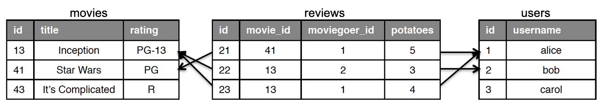
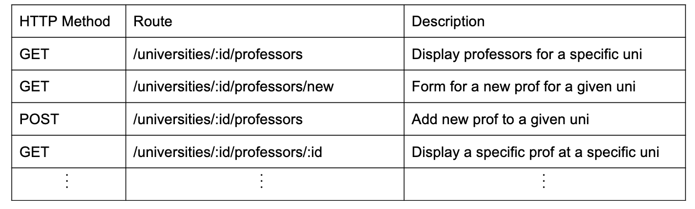

<!-- .slide: data-auto-animate -->

# Module 8 Discussion
<!-- .element: class="r-fit-text" -->
### TDD

*thanks to Paul Woo for slide inspiration*
<!-- .element: class="small" -->

--- <!-- .slide: data-auto-animate -->

# Agenda

- Berkeley Time: 10mins
- Worksheet: 25mins
- Lecture: 25mins

--- <!-- .slide: data-auto-animate -->

### TDD

*aka writing tests before you code new functionality*

<hr>

an aspect of Agile: <br>
unlike P&D, QA is not a separate team

+++ <!-- .slide: data-auto-animate -->

### TDD

#### Good Tests

*a FIRST principles approach 😛*
- Fast
- Independent
- Repeatable
- Self-Checking
- Timely

Note:
Fast - should not take long to run them or run a subset of them. Ideally should be automatic - everytime you change a file the tests should run

Independent - Every test should be able to run anytime in any order. Whatever conditions the test expects to be true before running, should be explicitly stated within the test.

Repeatable - Should not depend on external factors like time and date / or magic constants that will break the test if ther values change -- Think Y2K problem

Self-checking - The test should self-report whether it failed

Timely - Write test when code is written - In test driven development write test before the code is written

+++ <!-- .slide: data-auto-animate -->

### TDD

*that's nice and all, <br> but how do we actually do it?*

--- <!-- .slide: data-auto-animate -->

### RSpec

*how we actually do it*

+++ <!-- .slide: data-auto-animate -->

### RSpec

#### Quick Review

Define "SUT":

> the "System Under Test": <br> a method, method group, class, module...
<!-- .element: class="fragment wide" -->

+++ <!-- .slide: data-auto-animate -->

### RSpec

#### Quick Review

- a **suite** covers one SUT
- each **test** in a suite covers a specific behavior
- a **unit test** covers a single-method behavior
- generally, every test follows **3A** structure

*regretably, no, this is not the three-act structure*
<!-- .element: class="citation" -->

+++ <!-- .slide: data-auto-animate -->

### RSpec

#### 3A

- Arrange
- Act
- Assert

Note:
Every test has 3 main components - you have seen this in cucumber--

Arrange - set up necessary pre conditions /assumptions  for the test case. Given part in cucumber
Act - do something that stimulates the software - When in cucumber
Assert - check that something did or did not occur as a result - Then step of cucumber

Every non-trivial test more or less looks like this

- warn of problems *within methods* of a class
- fixes are usually within the cass itself
- fixed with *SOFA*

+++ <!-- .slide: data-auto-animate -->

### RSpec

#### 3A

- Arrange

> set up neccessary pre-conditions
<!-- .element: class="good wide" -->

- Act
- Assert

Note:
Every test has 3 main components - you have seen this in cucumber--

Arrange - set up necessary pre conditions /assumptions  for the test case. Given part in cucumber
Act - do something that stimulates the software - When in cucumber
Assert - check that something did or did not occur as a result - Then step of cucumber

Every non-trivial test more or less looks like this


+++ <!-- .slide: data-auto-animate -->

### RSpec

#### 3A

- Arrange
- Act

> exercise the SUT
<!-- .element: class="wide" -->

- Assert

Note:
Every test has 3 main components - you have seen this in cucumber--

Arrange - set up necessary pre conditions /assumptions  for the test case. Given part in cucumber
Act - do something that stimulates the software - When in cucumber
Assert - check that something did or did not occur as a result - Then step of cucumber

Every non-trivial test more or less looks like this


+++ <!-- .slide: data-auto-animate -->

### RSpec

#### 3A

- Arrange
- Act
- Assert

> verify behavior

Note:
Every test has 3 main components - you have seen this in cucumber--

Arrange - set up necessary pre conditions /assumptions  for the test case. Given part in cucumber
Act - do something that stimulates the software - When in cucumber
Assert - check that something did or did not occur as a result - Then step of cucumber

Every non-trivial test more or less looks like this


<!-- .element: class="bad wide" -->

+++ <!-- .slide: data-auto-animate -->

### RSpec

#### Syntax

- `describe [:sym|'sym']` defines a suite
- `context 'desc'` defines shared state
- `before` defines context-wide pre-conditions
- `it 'desc'` defines a single test


+++ <!-- .slide: data-auto-animate -->

### RSpec

#### Recap

*remember:*

- tests are short, specific, and descriptive
- nothing ever persists between tests...
- ...including `before` behaviors

*self check: so then how does `before` work?*
<!-- .element: class="small" -->

--- <!-- .slide: data-auto-animate -->

### A Difficult Example

```rb [|2-3|4-14|15-17]
class MovieController < ApplicationController
  def review_movie
    search_string = params[:search]
    begin
      matches = Movie.find_in_tmdb search_string
      if matches.empty?
        redirect_to review_movie_path, alert: "No matches!"
      elsif matches.length == 1
        @movie = matches[0]
        render review_movie_path
      else
        @movies = matches
        render select_movie_path
      end
    rescue Movie::ConnectionError => err
      redirect_to review_movie_path, alert: err.message
    end
  end
end
```

+++ <!-- .slide: data-auto-animate -->

### A Difficult Example

<table class="small">
<thead>
  <tr>
    <td>SUT Behavior/Property has...</td>
    <td>Example</td>
    <td>Testing Strategy</td>
  </tr>
</thead>
<tbody>
  <tr>
    <td>Depended-On Components (DOCs)</td>
    <td><code>Movie.search_in_tmdb</code></td>
    <td>isolate dependencies (usually in Arrange)</td>
  </tr>
  <tr>
    <td>side-effects</td>
    <td>setting <code>:alert</code></td>
    <td>ensure relevent state is set in Arrange, <br> always assert side-effect has occurred</td>
  </tr>
  <tr>
    <td>non-determinism/time-dependence</td>
    <td>--</td>
    <td>Arrange for the proper state</td>
  </tr>
</tbody>
</table>


### A Difficult Example

#### Seams

a place where you can change app behavior <br> *without* editting source

your friend in testing, helpful to have a plan for seams before writing code, so TDD helps make friends in testing!

+++ <!-- .slide: data-auto-animate -->

### A Difficult Example

#### Seams

*seam validation through message passing!*


Arranging (Stubs):
```rb
allow(@object).to recieve(:method_name).and_return(value)
# @object.method_name => value
```

Asserting (Double/Mocks):
```rb
expect(@object).to recieve(:method_name).with_params(value)
# if "@object.method_name value" called, success! otherwise fail!
```

+++ <!-- .slide: data-auto-animate -->

### A Difficult Example

*where are our 3As?*

```rb [|3,5||2||7,9-10,12-13,16]
class MovieController < ApplicationController
  def review_movie
    search_string = params[:search]
    begin
      matches = Movie.find_in_tmdb search_string
      if matches.empty?
        redirect_to review_movie_path, alert: "No matches!"
      elsif matches.length == 1
        @movie = matches[0]
        render review_movie_path
      else
        @movies = matches
        render select_movie_path
      end
    rescue Movie::ConnectionError => err
      redirect_to review_movie_path, alert: err.message
    end
  end
end
```

+++ <!-- .slide: data-auto-animate -->

### A Difficult Example

```rb []
describe MoviesController do
  describe 'looking up a movie' do
    it 'redirects to search page if no match' do
      allow(Movie).to recieve(:find_in_tmbd).and_return([])
      post 'review_movie', { search_string: '<no match>' }
      expect(response).to redirect_to(review_movie_path)
      expect(assigns(:alert))
    end
  end
end
```

+++ <!-- .slide: data-auto-animate -->
### Filters

#### An Example

*this very un-DRY pattern...*

```rb [|4-5|6-18]
class UserController < ApplicationController
  def is_admin?; ...; end

  def index; ...; end
  def show; ...; end
  def create;
    check_admin?
    ...;
  end
  def new;
    check_admin?
    ...;
  end
  def edit;
    check_admin?
    ...;
  end
  # ... more admin actions
end
```

+++ <!-- .slide: data-auto-animate -->
### Filters

#### An Example

*... becomes this*

```rb [|2-3|4-16]
class UserController < ApplicationController
  before_action :check_admin?, except: %i[ show index ]

  def index; ...; end
  def show; ...; end
  def create; ...; end
  def new; ...; end
  def edit; ...; end
  # ... more admin actions
end
```

+++ <!-- .slide: data-auto-animate -->
### Filters

*much like validators, plenty of builtins:*

- before_action
- after_action
- skip_before_action
- around_action
- ...

*but for this to be \*really\* useful, we need auth!*

--- <!-- .slide: data-auto-animate -->

### Check-in Problem

for each, fill in the blank with M/V/C:
- Partials are used in ___
- Validations are used in ___
- Filters are used in ___

+++ <!-- .slide: data-auto-animate -->

### Check-in Problem

for each, fill in the blank with M/V/C:
- Partials are used in Views
- Validations are used in Models
- Filters are used in Controllers

--- <!-- .slide: data-auto-animate -->

### SSO & Third Party Auth

*never implement by hand!*


### SSO & Third Party Auth

SSO allows us to have one password (eg for calnet) <br>
and reuse it everywhere

*this is DRY SOA, yay!*

for security, third-parties handle the "auth" part, <br> we are usually just left with a cooki

+++ <!-- .slide: data-auto-animate -->

### SSO & Third Party Auth

Rails has built-ins for auth that are very helpful

The Rails "Getting Started" has a section on it
--- <!-- .slide: data-auto-animate -->

### Associations

*how do we link models intelligently?*

+++ <!-- .slide: data-auto-animate -->

### Associations

#### SQL: The Old Days

what do we call a column of id's that point to another table?

> foreign keys
<!-- .element: class="fragment" -->

+++ <!-- .slide: data-auto-animate -->

### Associations

#### SQL: The Old Days



`reviews` has two foreign key columns:
- ???
- ???

+++ <!-- .slide: data-auto-animate -->

### Associations

#### SQL: The Old Days


`reviews` has two foreign key columns:
- `movie_id` (points to `movies.id`)
- `moviegoer_id` (points to `users.id`)

+++ <!-- .slide: data-auto-animate -->

### Associations

#### SQL: The Old Days


*finding Star Wars reviews*

```SQL
SELECT reviews.*
  FROM movies JOIN reviews ON movies.id=reviews.movie_id
  WHERE movies.title = “Star Wars”;
```

+++ <!-- .slide: data-auto-animate -->

### Associations

#### Rails


*finding Star Wars reviews*

```rb
Movie.where(title: "Star Wars").reviews
```

*there's subtle magic here!*

+++ <!-- .slide: data-auto-animate -->

### Associations


we say a `Review` `belongs_to` both `Movie` and `User` because it has
exactly one reference to each in it's own columns

this makes these methods accessible:
```rb
review = Reviews.first
review.movie
review.user
```

+++ <!-- .slide: data-auto-animate -->

### Associations


by contrast, `Movie` and `User` both `has_many` `Review`s

this makes these methods accessible:
```rb
Movies.first.reviews
Users.first.reviews
```

+++ <!-- .slide: data-auto-animate -->

### Associations

there are also "through" relationships


*example, anyone?*
<!-- .element: class="small" -->

Note:
On line 4, we “override” the find_in_tmdb by setting up a method stub.
In this case instead of calling the real method we call the “fake” method whose behavior we can control for each test case.
Use the allow(Movie) call to set up a stub that does not track whether the find_in_tmdb method is called.
Use the expect(Movie) instead on line 4 if we want to ensure find_in_tmdb method is called. Also known as “Spies”. I.e. expect(Movie).to_receive(:find_in_tmdb)
All seams setup for a test case are reset after the test case is run.

+++ <!-- .slide: data-auto-animate -->

### A Difficult Example

doubles are for when you need to replace just enough a DOC to isolate behavior of interest

we can also set variables and test by reference..

+++ <!-- .slide: data-auto-animate -->

### A Difficult Example

#### Through Example

```rb
class University < ActiveRecord::Base do
  has_many :professors
  # a through relationship!
  has_many :courses, through: :professors, uniq: true

  # ...
end


```

+++ <!-- .slide: data-auto-animate -->

### Associations

*associations are writable too!*

```rb
>>> CS169A = Course.create! name: “CS169A”
>>> prof_ball.courses << CS169A
>>> prof_fox.courses << CS169A
>>> uni_cal.profs << prof_ball << prof_fox
>>> assert(uni_cal.courses.includes? CS169A)
```

+++ <!-- .slide: data-auto-animate -->

### Associations

*associations also interact with REST routes using:*
```rb
Rails.application.routes.draw do
  ## used to be
  # resuources :universities
  resources :universities do
    resources :professors
  end
end
```


