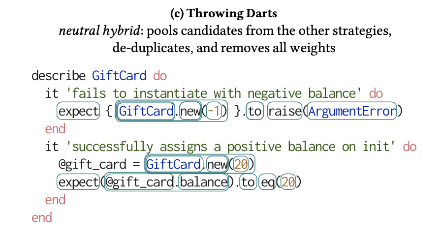

## Fading Strategies   for Parsons Problems   in Intermediate Classrooms

*what's the problem with parsons problems?*

+++

Parsons Problems are a "problem format"
- Chunk some code into lines & scramble
- Reorder & reindent codelines

+++

Parsons Problems work, but...
- Known effective (difficulty & retention)
- Able to autogen (nice bonus)

*they are prone to brute-forcing*

+++

Faded Parsons Problems help, but...
- No more brute-forcing
- potential "bad fading" (difficult or illegible)

*they require a “strategy” for fading*

+++

Fading strategy difficulty is not yet fully understood
- Studied in introductory courses
- Tested largely in C-like languages

*semantic vs syntactic tactics?*

+++

in short, the problems:
- how to make strategies that avoid "bad fading"
- previous strategies are language-bound
- no clear indication of sem./syn. tactic difficulty

*would be nice to get autogen back*

+++

We create a conceptual guide for creating language-agnostic fading strategies.
- Based on amalgam of previous work and our own experiences
- 5 guidelines based on “Legible, Reliable, Predictable”

*and we put it to use...*

+++

We generate three strategies using   a spectrum of "context-aware" tactics.
- Fromont $\rightarrow$ Us
- Semantic/Syntactic Spectrum

*and we study them...*

+++

We find a fine distinction between the strategies
- Difficulty & time are equivalent
- "Obfuscation" is not equivalent
- Randomness appears unfavorable

*after following the guide,   "bad fading" is about inconsistency*

*added bonus: this gives us easy autogen*

<!-- 6:20 here -->
---

## Related work
*where did we start from?*

+++

Landmark study of fading strategy difficulty: Fromont

The good:
- formalizes "strategy", "candidate", "selection"
- set a methodology for subj./obj. difficulty
- 2 syntactic strats (var, op), one kinda semantic (cond)

+++

Landmark study of fading strategy difficulty: Fromont

The bad:
- language-locked (strats mostly yield 0 candidates)
- wildly unpredictable (one strats yield way too many)

---

## A Guide for Strategy Creation

+++

Three basic principles for good strategies:
- legible: make fades easier to reason about
- reliable: make breaking the AG harder
- predictable: elicit familiar solutions and errors

+++ <!-- .slide: data-auto-animate -->

This yields five guidelines:

cognitive overhead of manipulating CFG

+++ <!-- .slide: data-auto-animate -->

This yields five guidelines:

ws seperated fades are redundant

+++ <!-- .slide: data-auto-animate -->

This yields five guidelines:

scoping symbols are usually wrangled by IDEs, and missing ones can cause AG context to leak or just really bad error messages

+++ <!-- .slide: data-auto-animate -->

This yields five guidelines:

don't tamper with var defs, good for AGs, trivial for students

+++ <!-- .slide: data-auto-animate -->

This yields five guidelines:

incomplete fades may be hard to catch and cause strange bugs, if parsing succeeds at all

+++

this is derived from Fromont, adhered to by others, and used for the rest of our work

---

## New Fading Strategies

*language-agnostic, context-aware*

+++

+++

+++

<!-- 22 mins to get here, first run -->

---

## Study Results
*how did our strategies stack up?*

+++

we mirrored the methodology in Fromont:
- we augmented with TLX and UI log data
- they had a x10 n, so stronger results

+++

Rough Equivalence of Difficulty & Efficacy
- Scores, time, attempts strong equiv at first sitting
- Subjective ratings equiv or non-stat sig
- Long-term retention weakly equiv after two weeks (62% resp.)

+++

Small moral: avoid "obfuscation"
- kind of like "interaction density/freq"
- remember, time is equivalent, but freq is not!
- Throwing Darts at least as bad as any other on all but one problem

+++

Mismatched Delimiters performs well on all metrics and is very easy to instrument...

*Bonus Moral: make a consistent strategy that meets the guidelines and is simple to implement!*

+++

Limitations:
- Smaller n and attrition for follow-up
- Strats equivalent only in aggregagte?
- Strange trend reversal on problem 1 only

---

## Conclusion

*we advise against random strategies and for simply implemented ones!*

to expand a limited body of work, we contribute:
- a guide for creating fading strategies
- a new set of "context-aware" strategies
- a comparitive study of those strategies
