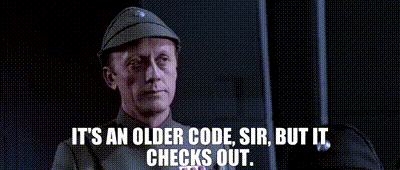

<!-- .slide: data-auto-animate -->

# Humor in Instruction
<!-- .element: class="r-fit-text" -->
### Takeaways from a 40-year Survey

--- <!-- .slide: data-auto-animate -->

### Takeaways from a 40-year Survey

+++ <!-- .slide: data-auto-animate -->

### Takeaways from a 40-year Survey

[Banas, Dunbar, Rodriguez & Liu - 2011]
<!-- .element: class="citation" style="font-size: 90%" -->

*findings reported in these slides   only pertain to mature learners*

10(0) crazy tips!  
the results ***won't*** surprise you

--- <!-- .slide: data-auto-animate -->

## Overview

### Theories of Humor
### Personal Aspects of Humor
#### Quantitative Work on Humor
### Humor and Learning
### Advice for Educators

--- <!-- .slide: data-auto-animate -->

### Theories of Humor

*what psychological models explain funniness?*  
<em class="green">what pedagogical models explain humor in class?</em>

+++ <!-- .slide: data-auto-animate -->

### Theories of Humor

**superiority model**

**arousal model**

**incongruity model**

**instructional humor processing theory**
<!-- .element: class="green" -->

+++ <!-- .slide: data-auto-animate -->

### Theories of Humor

**superiority model**

*humor as competitive play (see monkeys)*

doesn't require intention or imply malice
<!-- .element: class="small fragment" -->

most useful today to define inappropriate humor
<!-- .element: class="fragment" -->

+++ <!-- .slide: data-auto-animate -->

***Lessons from the Superiority Model***

+++ <!-- .slide: data-auto-animate -->

***Lessons from the Superiority Model***
#### Things You Definitely Shouldn't Do

- mock any class member(s)
<!-- .element: class="fragment" -->
- ridicule learners or learning
<!-- .element: class="fragment" -->
- joke about any nameable community
<!-- .element: class="fragment" -->

Note:
- your students, assistants, co-teachers, colleagues
- learning speeds/styles/preferences/differences
- any marginalized *(or identifiable)* community
**exaggerate, ridicule**

+++ <!-- .slide: data-auto-animate -->

***Lessons from the Superiority Model***
#### Things You Definitely Shouldn't Do

avoid mocking yourself! *(mostly\*)*

*students were divided on appropriateness,  
but it may damage credibility regardless
<!-- .element: class="citation fragment" -->

+++ <!-- .slide: data-auto-animate -->

***Lessons from the Superiority Model***

offensive humor (including ridicule)  
forms the basis of inappropriate humor

--- <!-- .slide: data-auto-animate -->

### Theories of Humor

*superiority model*

**arousal model**

**incongruity model**

**instructional humor processing theory**

+++ <!-- .slide: data-auto-animate -->

### Theories of Humor

**arousal model**

*humor as subconscious/emotional processing*

mostly useful today for expert/printed humor
<!-- .element: class="fragment" -->

Note: **not as fun as it sounds**

+++ <!-- .slide: data-auto-animate -->

***Lessons from the Arousal Model***

*avoid putting jokes on exams*
<!-- .element: class="fragment" -->

(though it did decrease exam anxiety for high anxiety students)
<!-- .element: class="citation fragment" -->

+++ <!-- .slide: data-auto-animate -->

***Lessons from the Arousal Model***

humor eases in-the-moment emotional processing

it can be used to protect oneself or,  
to release tension following shock/surprise

*be careful, it can also backfire*

[hooks *Teaching Critical Thinking* 2010 - Ch.13]   thanks Lisa!
<!-- .element: class="citation" -->

+++ <!-- .slide: data-auto-animate -->

*from here on, we're talking about appropriate humor*

but first, what did I do wrong so far...
<!-- .element: class="fragment" -->

--- <!-- .slide: data-auto-animate -->

### Theories of Humor

*superiority model*

*arousal model*

**incongruity model**

**instructional humor processing theory**

+++ <!-- .slide: data-auto-animate -->

### Theories of Humor

*superiority model*

*arousal model*

**instructional humor processing theory**

**incongruity model**

+++ <!-- .slide: data-auto-animate -->

### Theories of Humor

**instructional humor processing theory**

*humor as invitation to elaborate*

[Wanzer et al. - 2010]
<!-- .element: class="citation" -->

+++ <!-- .slide: data-auto-animate -->

### Theories of Humor

**instructional humor processing theory**

draws on *elaboration likelihood model* of persuasion

> what does it take to change hearts   as a speaker
<!-- .element: class="wide fragment" -->

+++ <!-- .slide: data-auto-animate -->

### Theories of Humor

**instructional humor processing theory**

draws on *elaboration likelihood model* of persuasion

high elaboration = high likelihood of attitude shift

[Allport - 1935, Ross - 1908]
<!-- .element: class="citation" -->

+++ <!-- .slide: data-auto-animate -->

+++ <!-- .slide: data-auto-animate -->

### Theories of Humor

**instructional humor processing theory**

generally good for predictions:
- content-related humor correlated with learning
- disparaging/offensive humor **didn't** correlate

+++ <!-- .slide: data-auto-animate -->

### Theories of Humor

*superiority model*

*arousal model*

*instructional humor processing theory*

**incongruity model**

+++ <!-- .slide: data-auto-animate -->

### Theories of Humor

**incongruity model**

*humor as cognitive mismatch*

content-related humor came out  
the clear winner for planned humor

IHPT backs this up

Note: surprising contradiction invites elaboration

+++ <!-- .slide: data-auto-animate -->

### Theories of Humor

*superiority model*

*arousal model*

*instructional humor processing theory*

*incongruity model*

+++ <!-- .slide: data-auto-animate -->

## Overview

### Theories of Humor
### Personal Aspects of Humor
#### Quantitative Work on Humor
### Humor and Learning
### Advice for Educators

--- <!-- .slide: data-auto-animate -->

### Personal Aspects of Humor

*how does my personality affect my humor?*  
*how does humor change my image?*

+++ <!-- .slide: data-auto-animate -->

### Personal Aspects of Humor
#### A Brief Detour on *You*

+++ <!-- .slide: data-auto-animate -->

#### A Brief Detour on *You*

as a *person*, you may be:
- more/less humor-oriented
- more/less witty/sardonic
- more/less personable

*all of these can change with time and effort!*

[bell hooks]
<!-- .element: class="citation" -->

+++ <!-- .slide: data-auto-animate -->

#### A Brief Detour on *You*

as an **instructor**, you may be:
- more/less immediate
- more/less technical
- more/less warm

*all of these can change with time and effort!*

[fight me]
<!-- .element: class="citation" -->

+++ <!-- .slide: data-auto-animate -->

#### A Brief Detour on *You*

<h4>humor-oriented</h4>
<h4>witty/sardonic</h4>
<h4>personable</h4>

<h4>immediate</h4>
<h4>technical</h4>
<h4>warm</h4>

*your style of humor should reflect   your classroom persona*

--- <!-- .slide: data-auto-animate -->

### Personal Aspects of Humor

*how does my personality affect my humor?*  
*how does humor change my image?*

+++ <!-- .slide: data-auto-animate -->

### Personal Aspects of Humor
**personal perception**

- leaning into humor orientation is usually positive
<!-- .element: class="fragment" -->
- makes faculty more approachable outside class
<!-- .element: class="fragment" -->
- immediacy's effect on reception is unclear*
<!-- .element: class="fragment" -->

*all of these are subject to cultural variation*
<!-- .element: class="fragment" -->

Note: immediacy - engendering closeness

*inappropriate humor from immediate teachers is significantly worse

+++ <!-- .slide: data-auto-animate -->

### Personal Aspects of Humor
**credibility**

+++ <!-- .slide: data-auto-animate -->

### Personal Aspects of Humor
**credibility**

credibility comes from:
- expertise
- trustworthiness
<!-- .element: class="fragment" -->
- goodwill
<!-- .element: class="fragment" -->

[Teven and McCrosky - 1997]
<!-- .element: class="citation" -->

Note: literally studied since Aristotle
- authoritativeness, composure, competency
- sincerity
- "know your audience" and what they want

+++ <!-- .slide: data-auto-animate -->

### Personal Aspects of Humor
**credibility**

humor alone ups trustworthiness, goodwill,  
& composure, but doesn't increase competency

*on the whole, humor increases credibility*\*

*overuse upsets the balance by decreasing perceived goodwill
<!-- .element: class="citation fragment" -->

**inappropriate humor is bad for everything
<!-- .element: class="citation fragment" -->

+++ <!-- .slide: data-auto-animate -->

### Personal Aspects of Humor
**(dated) gender observations**

- men can use tendentious humor,   women shouldn't
- men make more attempts at humor,   *be careful of overuse*

*from students' reports in dated/small-n studies*

Note: tendentious: promote a controversial opinion

+++ <!-- .slide: data-auto-animate -->

### Personal Aspects of Humor
**(dated) gender observations**

according to students,  
women used higher proportions of:
- content-related humor
- social stratifying humor

statistically significant findings, but   *we may be showing our biases here*

+++ <!-- .slide: data-auto-animate -->

## Overview

### Theories of Humor
### Personal Aspects of Humor
#### Quantitative Work on Humor
### Humor and Learning
### Advice for Educators

--- <!-- .slide: data-auto-animate -->

### Quantitative Work on Humor

*how much is \*too much\*?*  

+++ <!-- .slide: data-auto-animate -->

### Quantitative Work on Humor

attempt frequency is all over the place

varies by uni, culture, country, experience...

+++ <!-- .slide: data-auto-animate -->

### Quantitative Work on Humor

some conjecture on   collectivism/individualism on reception

foreign language learner's attitude towards in-class humor
and enjoyment of content had far greater effect on reception
than proficiency in the language
<!-- .element: class="fragment" -->

[Neff & Dewaele - 2023]
<!-- .element: class="citation fragment" -->

+++ <!-- .slide: data-auto-animate -->

### Quantitative Work on Humor

some profs don't use humor at all (< 2 attempts/hr)

award-winning lecturers warn against frequent use  
(avg 7.5 attempts/hr)

experienced faculty use humor more than GSIs  
(avg 6.5 vs 1.5 attempts/hr)

Note: sometimes upwards of 40% don't use, others less than 20%

+++ <!-- .slide: data-auto-animate -->

### Quantitative Work on Humor

4 attempts/hr seems optimal  
*(but again, your mileage __will__ vary)*

**know your audience!**

+++ <!-- .slide: data-auto-animate -->

## Overview

### Theories of Humor
### Personal Aspects of Humor
#### Quantitative Work on Humor
### Humor and Learning
### Advice for Educators

--- <!-- .slide: data-auto-animate -->

### Humor and Learning

*what does the research say about utility?*

+++ <!-- .slide: data-auto-animate -->

### Humor and Learning

*all of this is hotly contested in literature!*

unsubstantiated claims in this section  
imply strong consensus in literature

+++ <!-- .slide: data-auto-animate -->

### Humor and Learning
**retention**

on the one hand,  
numerous studies* find no change  
(a few even showed negative correlation)

*\*many discredited for study design issues*
<!-- .element: class="citation fragment" -->

Note: criticized for study design issues (retention time-frame, what kinds of humor, small n)

+++ <!-- .slide: data-auto-animate -->

### Humor and Learning
**retention**

on the other hand,  
some show positive correlation, particularly when:
- format/appropriateness is controlled
<!-- .element: class="fragment" -->
- retention checked after 2 months
<!-- .element: class="fragment" -->
- humor is employed during lecture
<!-- .element: class="fragment" -->
- curriculum-relevant humor is used
<!-- .element: class="fragment" -->

+++ <!-- .slide: data-auto-animate -->

### Humor and Learning
**attention**

humor is good at gaining/keeping attention

*this meshes with IHPT's predictions*

Note: "substantial empirical support"

a humorous cognitive mismatch invites elaboration

+++ <!-- .slide: data-auto-animate -->

### Humor and Learning
**avoiding poor outcomes**

beware the propensity to "eat the onion"

students may only remember the joke,   not the related content

+++ <!-- .slide: data-auto-animate -->

### Humor and Learning
**main learning takeaway**

*think of humor like a verbal highlighter*

b/c students may only remember the joke,  
*be sure to repeat the content (if any) after*
<!-- .element: class="fragment" -->

don't highlight ironically.  
don't pick your target at random.  
don't get upset if the joke doesn't work.
<!-- .element: class="fragment" -->

+++ <!-- .slide: data-auto-animate -->

## Overview

### Theories of Humor
### Personal Aspects of Humor
#### Quantitative Work on Humor
### Humor and Learning
### Advice for Educators

--- <!-- .slide: data-auto-animate -->

### Advice for Educators

*that was a lot... now what?*

+++ <!-- .slide: data-auto-animate -->

### Advice for Educators

**what kinds of humor are out there?**

<h4>more culturally sensitive</h4>

funny stories

puns & jokes

sidebar*

comics/clips

dark/witty humor

<h4>less culturally sensitive</h4>

facial expression

sound effects

visual gags

prop/object work

comedy of attitude

Note: fav form of sidebar is written

+++ <!-- .slide: data-auto-animate -->

### Advice for Educators

**"always appropriate" classes of humor**

- Content-Relevant
- Solidarity-Based
- Self-Enhancing
- Funny Stories
- Short Sidebar

note:
-
- amuse others, relieve tension
- defending oneself, coping with spontaneous problems, emotional regulation
-
- keep it brief!

other types: boundary setting and phone a friend - careful on appropriateness

+++ <!-- .slide: data-auto-animate -->

### Advice for Educators

**General Checklist**

*1. use humor you are comfortable with*

*2. use appropriate humor*

*3. know your audience*

+++ <!-- .slide: data-auto-animate -->

### Advice for Educators

**General Checklist**

*1. use humor you are comfortable with*
- or use none, if you're uncomfortable
- know your humor style & orientation
- use clips/cartoons where spontaneity fails

+++ <!-- .slide: data-auto-animate -->

### Advice for Educators

**General Checklist**

*2. use appropriate humor*
- **always** avoid isolating/disparaging humor
- humor changes the class atmosphere quickly
- use content-relevant or self-enhancing humor

+++ <!-- .slide: data-auto-animate -->

### Advice for Educators

**General Checklist**

*3. know your audience*
- overuse of humor degrades credibility
- double-check (pop-)cultural references
  - if you gotta explain it: don't use it
  - if you use it: use it, don't re-enact it

+++ <!-- .slide: data-auto-animate -->

### Advice for Educators

**General Checklist**

*1. use humor you are comfortable with*

*2. use appropriate humor*

*3. know your audience*

+++ <!-- .slide: data-auto-animate -->

### Advice for Educators

**When Planning a Joke:**

1. humor should be a conceptual highlighter
2. paraphrase concept after the joke
3. leverage memorability with a callback

--- <!-- .slide: data-auto-animate -->

## Thanks!

<h4>when should I use humor?</h4>
<ol>
<li>use <em>your</em> humor</li>
<li>keep it appropriate</li>
<li>know your audience</li>
</ol>

<h4>how should I plan humor?</h4>
<ol>
<li>humor is a highlighter</li>
<li>rephrase afterwards</li>
<li>use a callback</li>
</ol>

[Banas, Dunbar, Rodriguez & Liu - 2011]
<!-- .element: class="citation" -->
[hooks - 2010]
<!-- .element: class="citation" -->