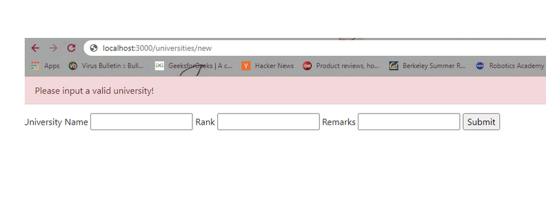

<!-- .slide: data-auto-animate -->

### Warm-Up Rounds
<div class="col-container">
<div class="col text-left small" style="margin-right: 20px">

  Which of the following would interpolate an attribute from an instance variable set in an `ApplicationController`?
  <ol style="list-style-type: upper-alpha">
    <li><%= product.name %></li>
    <li><%= @product.name %></li>
    <li><% @product.name do |n| n.to_s %></li>
  </ol>

  Which of the following properly desugars: `run cmd: 'sudo', args: %w[python my.py]`
  <ol style="list-style-type: upper-alpha">
  <li>`run('sudo', %w[python my.py])`</li>
  <li>`run(cmd: 'sudo', args: %w[python my.py])`</li>
  <li>`run({ cmd: 'sudo', args: %w[python my.py] })`</li>
  </ol>
</div>
<div class="col text-left small">

  Which of these queries would return one or zero items?
  <ol style="list-style-type: upper-alpha">
    <li>`Products.where name: "Boots"`</li>
    <li>`Products.find_by name: "Boots"`</li>
    <li>`Products[name: "Boots"]`</li>
  </ol>

  Which of these does *not* create a migration?
  <ol style="list-style-type: upper-alpha">
    <li>`$ rails g model Product`</li>
    <li>`$ rails generate migration AddShirtSizes`</li>
    <li>`$ rails new store -T`</li>
  </ol>
</div>
</div>

+++ <!-- .slide: data-auto-animate -->

### Warm-Up Rounds
<div class="col-container">
<div class="col text-left small" style="margin-right: 20px">

  Which of the following would interpolate an attribute from an instance variable set in an `ApplicationController`?
  <ol style="list-style-type: upper-alpha">
    <li><%= product.name %></li>
    <li class="bold"><%= @product.name %></li>
    <li><% @product.name do |n| n.to_s %></li>
  </ol>

  Which of the following properly desugars: `run cmd: 'sudo', args: %w[python my.py]`
  <ol style="list-style-type: upper-alpha">
  <li>`run('sudo', %w[python my.py])`</li>
  <li>`run(cmd: 'sudo', args: %w[python my.py])`</li>
  <li class="bold">`run({ cmd: 'sudo', args: %w[python my.py] })`</li>
  </ol>
</div>
<div class="col text-left small">

  Which of these queries would return one or zero items?
  <ol style="list-style-type: upper-alpha">
    <li>`Products.where name: "Boots"`</li>
    <li class="bold">`Products.find_by name: "Boots"`</li>
    <li>`Products[name: "Boots"]`</li>
  </ol>

  Which of these does *not* create a migration?
  <ol style="list-style-type: upper-alpha">
    <li>`$ rails g model Product`</li>
    <li>`$ rails generate migration AddShirtSizes`</li>
    <li class="bold">`$ rails new store -T`</li>
  </ol>
</div>
</div>
</div>

--- <!-- .slide: data-auto-animate -->
# Module 5 Discussion
<!-- .element: class="r-fit-text" -->
### Wide Ranging Review

partials, validations, filters & associations

*thanks to Paul Woo for slide inspiration*
<!-- .element: class="small" -->

--- <!-- .slide: data-auto-animate -->

### Partials

*a reusable chunk of view*

+++ <!-- .slide: data-auto-animate -->

### Partials

*a reusable chunk of view*

- Renders the same snippet repeatedly
- Conventional naming (ofc)
- use `<%= render partial: '<rel-path>' %>`

*example anybody?*
<!-- .element: class="fragment" -->

+++ <!-- .slide: data-auto-animate -->

### Partials

*rendering a table of unis*

```html [|1-5|6,12|6-12|]
<div class=”row”>
    <div class=”col-6 text-center”>Name</div>
    <div class=”col-2 text-center”>Rank</div>
    <div class=”col-4 text-center”>Remarks</div>
</div>
<% @universities.each do |university| %>
<div class=”row”>
    <div class=”col-6 text-center”><%= university.name %></div>
    <div class=”col-2 text-center”><%= university.rank %></div>
    <div class=”col-4 text-center”><%= university.remarks %></div>
</div>
<% end %>
```
`universities/index.html.erb`
<!-- .element: class="small" --
+++ <!-- .slide: data-auto-animate -->

### Partials

**note: a standard listing opereation**

```[6] html
<div class=”row”>
    <div class=”col-6 text-center”>Name</div>
    <div class=”col-2 text-center”>Rank</div>
    <div class=”col-4 text-center”>Remarks</div>
</div>
<% @universities.each do |university| %>
<div class=”row”>
    <div class=”col-6 text-center”><%= university.name %></div>
    <div class=”col-2 text-center”><%= university.rank %></div>
    <div class=”col-4 text-center”><%= university.remarks %></div>
</div>
<% end %>
```
`universities/index.html.erb`
<!-- .element: class="small" -->

+++ <!-- .slide: data-auto-animate -->

### Partials

**note: a standard listing operation**

```[6] html
<div class=”row”>
    <div class=”col-6 text-center”>Name</div>
    <div class=”col-2 text-center”>Rank</div>
    <div class=”col-4 text-center”>Remarks</div>
</div>
<% @top_universities.each do |university| %>
<div class=”row”>
    <div class=”col-6 text-center”><%= university.name %></div>
    <div class=”col-2 text-center”><%= university.rank %></div>
    <div class=”col-4 text-center”><%= university.remarks %></div>
</div>
<% end %>
```
`universities/top/index.html.erb`
<!-- .element: class="small" -->
+++ <!-- .slide: data-auto-animate -->

### Partials

**note: a standard listing opereation**

```[6] html
<div class=”row”>
    <div class=”col-6 text-center”>Name</div>
    <div class=”col-2 text-center”>Rank</div>
    <div class=”col-4 text-center”>Remarks</div>
</div>
<% @similar_universities.each do |university| %>
<div class=”row”>
    <div class=”col-6 text-center”><%= university.name %></div>
    <div class=”col-2 text-center”><%= university.rank %></div>
    <div class=”col-4 text-center”><%= university.remarks %></div>
</div>
<% end %>
```
`universities/similar/index.html.erb`
<!-- .element: class="small" -->

+++ <!-- .slide: data-auto-animate -->

*this is repetitive -- time to DRY!*

the solution here is...

### Partials
<!-- .element: class="fragment" -->

specifically: `_university_entry.html.erb`
<!-- .element: class="fragment" -->

*^^ note the underscore leader*
<!-- .element: class="fragment small" -->

+++ <!-- .slide: data-auto-animate -->

### Partial

``` html
<div class="row">
    <div class="col-6 text-left"><%= university_entry.name %></div>
    <div class="col-2 text-center"><%= university_entry.rank %></div>
    <div class="col-4 text-left"><%= university_entry.remarks %></div>
</div>
```
`universities/_university_entry.html.erb`
<!-- .element: class="small" -->

***the "object" local variable must match the name of the file (w/o `"_"`)***
<!-- .element: class="fragment small" -->


+++ <!-- .slide: data-auto-animate -->

### Partials

*then this...*

```[6-12] html
<div class=”row”>
    <div class=”col-6 text-center”>Name</div>
    <div class=”col-2 text-center”>Rank</div>
    <div class=”col-4 text-center”>Remarks</div>
</div>
<% @top_universities.each do |university| %>
<div class=”row”>
    <div class=”col-6 text-center”><%= university.name %></div>
    <div class=”col-2 text-center”><%= university.rank %></div>
    <div class=”col-4 text-center”><%= university.remarks %></div>
</div>
<% end %>
```
`universities/top/index.html.erb`
<!-- .element: class="small" -->


+++ <!-- .slide: data-auto-animate -->

### Partials

*...becomes this!*

```[6-8] html
<div class=”row”>
    <div class=”col-6 text-center”>Name</div>
    <div class=”col-2 text-center”>Rank</div>
    <div class=”col-4 text-center”>Remarks</div>
</div>
<% @top_universities.each do |university| %>
  <%= render partial: 'university_entry', object: university %>
<% end %>
```
`universities/top/index.html.erb`
<!-- .element: class="small" -->

*note: no underscore in partial path!*
<!-- .element: class="small" -->

+++ <!-- .slide: data-auto-animate -->

### Partials

*...or even this!*

```[6] html
<div class=”row”>
    <div class=”col-6 text-center”>Name</div>
    <div class=”col-2 text-center”>Rank</div>
    <div class=”col-4 text-center”>Remarks</div>
</div>
<%= render partial: 'university_entry', collection: @top_universities %>
```
`universities/top/index.html.erb`
<!-- .element: class="small" -->

+++ <!-- .slide: data-auto-animate -->

### Partials

#### A Note on Locals

*you can use undefined local variables...*

```html
<h3><%= local_ex[:title] %></h3>
<div class=”row”>
    <div class=”col-6 text-center”><%= foo %></div>
    <div class=”col-2 text-center”><%= bar %></div>
    <div class=”col-4 text-center”><%= baz %></div>
</div>
```
`universities/_local_ex.html.erb`
<!-- .element: class="small" -->

+++ <!-- .slide: data-auto-animate -->

### Partials

#### A Note on Locals

*...but you'll have to define 'em.*

```html
<h3><%= local_ex[:title] %></h3>
<div class=”row”>
    <div class=”col-6 text-center”><%= foo %></div>
    <div class=”col-2 text-center”><%= bar %></div>
    <div class=”col-4 text-center”><%= baz %></div>
</div>
```
`universities/_local_ex.html.erb`
<!-- .element: class="small" -->

```
<%= render partial: 'local_ex',
  object: { title: "An Example" }
  locals: { foo: "quack", bar: 3, baz: "times" }
  %>
```

+++ <!-- .slide: data-auto-animate -->

### Partials

*in conclusion...*

- We *could* generate dynamic views, but partials are cleaner and conventional
- This is a small example, but partials are powerful!

--- <!-- .slide: data-auto-animate -->

### Validations

*DRYing model constraints*

+++ <!-- .slide: data-auto-animate -->

### Validations

### Recap

- Models have fields with db types
- Validation is called in db lifecycle methods: <br> `create`, `save`, `update`
- Validation errors in `model.errors`
- Tons of built-ins, but custom validations possible!


+++ <!-- .slide: data-auto-animate -->

### Validations

*a common action*

```rb
  ...
  # default impl, provides creation POST form
  # def new
  #   render 'new.html.erb'
  # end

  def create
    university = University.create!(params)
    redirect_to :action => “show”, :id => university.id
  end
  ...
```
`controllers/university_controller.rb`
<!-- .element: class="small" -->


+++ <!-- .slide: data-auto-animate -->

### Validations

#### Example (w/o Validation)


+++ <!-- .slide: data-auto-animate -->

### Validations

#### Example (w/o Validation)


+++ <!-- .slide: data-auto-animate -->

### Validations


+++ <!-- .slide: data-auto-animate -->

### Validations

#### Example (w/Validation)

*constraints for our `University` model?*

```rb
class CreateUniversities < ActiveRecord::Migration[8.0]
  def change
    create_table 'universities' do |t|
      t.string :name
      t.integer :rank

      t.timestamps
    end
  end
end
```

+++ <!-- .slide: data-auto-animate -->

### Validations

#### Example (w/Validation)

*constraints for our `University` model?*

- Non-nil/empty name
- A "valid" rank $\[1-\texttt{Integer.MAX}\]$

+++ <!-- .slide: data-auto-animate -->

### Validations

#### Example (w/Validation)

*our default generated file*

```rb
class University < ApplicationRecord
end
```
`model/university.rb`
<!-- .element: class="small" -->

+++ <!-- .slide: data-auto-animate -->

### Validations

#### Example (w/Validation)

*tackling the non-empty name*

```rb [2]
class University < ApplicationRecord
  validates :name, presence: true, length: { minimum: 1 }
end
```
`model/university.rb`
<!-- .element: class="small" -->

+++ <!-- .slide: data-auto-animate -->

### Validations

#### Example (w/Validation)

*rank logic is trickier...*

```rb [3-11]
class University < ApplicationRecord
  validates :name, presence: true, length: { minimum: 1 }
  validate :correct_rank_provided

  def correct_rank_provided
    rank_max = 2 ** (0.size * 8 - 2) - 1

    if rank > rank_max || rank <= 0
      errors.add(:rank, "must be between 1 and #{rank_max}")
    end
  end
end
```
`model/university.rb`
<!-- .element: class="small" -->

+++ <!-- .slide: data-auto-animate -->

### Validations

#### Example (w/Validation)

*how do we cap to number of unis?*

```rb [3-11]
class University < ApplicationRecord
  validates :name, presence: true, length: { minimum: 1 }
  validate :correct_rank_provided

  def correct_rank_provided
    rank_max = ????

    if rank > rank_max || rank <= 0
      errors.add(:rank, "must be between 1 and #{rank_max}")
    end
  end
end
```
`model/university.rb`
<!-- .element: class="small" -->

+++ <!-- .slide: data-auto-animate -->

### Validations

#### Example (w/Validation)

*how do we cap to number of unis?*

```rb [3-11]
class University < ApplicationRecord
  validates :name, presence: true, length: { minimum: 1 }
  validate :correct_rank_provided

  def correct_rank_provided
    rank_max = Universities.all.length + 1

    if rank > rank_max || rank <= 0
      errors.add(:rank, "must be between 1 and #{rank_max}")
    end
  end
end
```
`model/university.rb`
<!-- .element: class="small" -->

+++ <!-- .slide: data-auto-animate -->

### Validations

#### Example (w/Validation)


+++ <!-- .slide: data-auto-animate -->

### Validations

#### Example (w/Validation)


*wait, it's still broken?*
<!-- .element: class="fragment small" -->

+++ <!-- .slide: data-auto-animate -->

### Validations

#### Example (w/Validation)

```rb [3]
  # ...
  def create
    university = University.create!(uni_params)
    redirect_to :action => “show”, :id => university.id
  end
  # ...
```
`controllers/university_controller.rb`
<!-- .element: class="small" -->

*this is the difference with `create!` and `create`*

+++ <!-- .slide: data-auto-animate -->

### Validations

#### Example (w/Validation)

```rb [4-5|3,6,9|3-6|6-9|]
  ...
  def create
    begin
      university = University.create!(uni_params)
      redirect_to :action => “show”, :id => university.id
    rescue ActiveRecord::RecordInvalid
      flash[:alert] = "Please input a valid university and rank!"
      redirect_to :action => “new”
    end
  end
  ...

```
`controllers/university_controller.rb`
<!-- .element: class="small" -->

*this is the difference with `create!` and `create`*

+++ <!-- .slide: data-auto-animate -->

### Validations

#### A Note on `!` methods

*this is the difference with `create!` and `create`*


|           | on fail       | on pass          |
|-----------|---------------|------------------|
| `create`  | `false`       | `true`           |
| `create!` | `raise Error` | `#<Obj:0xXXX>`   |

*pitfall: `Controller#create` is something entirely different: a routing action. <br>It should not have a `!` version*
<!-- .element: class="small" -->

+++ <!-- .slide: data-auto-animate -->

### Validations

#### A Note on `!` methods

*I recommend using `!` methods because...*
- In theory, bad validation is a control flow switch
- In practice, it's conventional and costs very little

+++ <!-- .slide: data-auto-animate -->

### Validations

#### Example (w/Validation)


+++ <!-- .slide: data-auto-animate -->

### Validations

#### Example (w/Validation)



+++ <!-- .slide: data-auto-animate -->

### Validations

*note: we don't have to use `create`s...*

```rb
  # ...
  def create
    university = University.new(uni_params)
    if university.valid?
      university.save!
      redirect_to :action => “show”, :id => university.id
    else
      if !university.errors[:rank].empty?
        flash[:alert] = “Rank “ + university.errors[:rank].first
      else # missing required name
        flash[:alert] = “Name “ + university.errors[:name].first
      end
      redirect_to :action => “new”
    end
  end
  # ...
```

+++ <!-- .slide: data-auto-animate -->

### Validations

*we can tag errors like so:*

```rb
  def correct_rank_provided
    rank_max = Universities.all.length + 1
    cal_names = [“UCB”, “Cal”, “UC Berkeley”]

    if !cal_names.include?(name) and rank == 1
      errors.add(:rank, "must not be 1 if university is not Cal")
    elsif cal_names.include?(name) and rank != 1
      errors.add(:rank, "must be 1 if Cal is provided")
    elsif rank > rank_max || rank <= 0
      errors.add(:rank, "must be a valid positive integer")
    end
  end
```

+++ <!-- .slide: data-auto-animate -->

### Validation

*there are tons more validations:*

```rb
# examples
# e.g. for a tshirt
validates :size, inclusion: { in: %w(small medium large),
    message: "%{value} is not a valid size" }

# e.g. for an account
validates :email, uniqueness: true

# or even multiple fields with one validator
validates :name, :login, :email, presence: true
```

[check out the docs](https://guides.rubyonrails.org/active_record_validations.html)

+++ <!-- .slide: data-auto-animate -->

### Validations

*in conclusion...*

- Validations are defined on the model
- Built-ins will take you very far, but...
- Instance methods can become custom validations

--- <!-- .slide: data-auto-animate -->

### Filters

*manages duplicated control flow logic across controller actions*

<br>

*this means we can make "a validator for a controller actions"!*
<!-- .element: class="small" -->

+++ <!-- .slide: data-auto-animate -->
### Filters

#### An Example

*we have some controller logic*

```rb []
class UserController < ApplicationController
  def check_admin?
    unless logged_in? # depends on how we implement auth
      flash[:alert] = "Login required."
      redirect_to universities_path
    end
  end
  # ... actions
end
```

+++ <!-- .slide: data-auto-animate -->
### Filters

#### An Example

*this very un-DRY pattern...*

```rb [|4-5|6-18]
class UserController < ApplicationController
  def is_admin?; ...; end

  def index; ...; end
  def show; ...; end
  def create;
    check_admin?
    ...;
  end
  def new;
    check_admin?
    ...;
  end
  def edit;
    check_admin?
    ...;
  end
  # ... more admin actions
end
```

+++ <!-- .slide: data-auto-animate -->
### Filters

#### An Example

*... becomes this*

```rb [|2-3|4-16]
class UserController < ApplicationController
  before_action :check_admin?, except: %i[ show index ]

  def index; ...; end
  def show; ...; end
  def create; ...; end
  def new; ...; end
  def edit; ...; end
  # ... more admin actions
end
```

+++ <!-- .slide: data-auto-animate -->
### Filters

*much like validators, plenty of builtins:*

- before_action
- after_action
- skip_before_action
- around_action
- ...

*but for this to be \*really\* useful, we need auth!*

--- <!-- .slide: data-auto-animate -->

### Check-in Problem

for each, fill in the blank with M/V/C:
- Partials are used in ___
- Validations are used in ___
- Filters are used in ___

+++ <!-- .slide: data-auto-animate -->

### Check-in Problem

for each, fill in the blank with M/V/C:
- Partials are used in Views
- Validations are used in Models
- Filters are used in Controllers

--- <!-- .slide: data-auto-animate -->

### Associations

*how do we link models intelligently?*

+++ <!-- .slide: data-auto-animate -->

### Associations

#### SQL: The Old Days

what do we call a column of id's that point to another table?

> foreign keys
<!-- .element: class="fragment" -->

+++ <!-- .slide: data-auto-animate -->

### Associations

#### SQL: The Old Days


`reviews` has two foreign key columns:
- ???
- ???

+++ <!-- .slide: data-auto-animate -->

### Associations

#### SQL: The Old Days


`reviews` has two foreign key columns:
- `movie_id` (points to `movies.id`)
- `moviegoer_id` (points to `users.id`)

+++ <!-- .slide: data-auto-animate -->

### Associations

#### SQL: The Old Days


*finding Star Wars reviews*

```SQL
SELECT reviews.*
  FROM movies JOIN reviews ON movies.id=reviews.movie_id
  WHERE movies.title = “Star Wars”;
```

+++ <!-- .slide: data-auto-animate -->

### Associations

#### Rails


*finding Star Wars reviews*

```rb
Movie.where(title: "Star Wars").reviews
```

*there's subtle magic here!*

+++ <!-- .slide: data-auto-animate -->

### Associations


we say a `Review` `belongs_to` both `Movie` and `User` because it has
exactly one reference to each in it's own columns

this makes these methods accessible:
```rb
review = Reviews.first
review.movie
review.user
```

+++ <!-- .slide: data-auto-animate -->

### Associations


by contrast, `Movie` and `User` both `has_many` `Review`s

this makes these methods accessible:
```rb
Movie.first.reviews
User.first.reviews
```

+++ <!-- .slide: data-auto-animate -->

### Associations

imagine if we had `n` fixed sprites in a table, <br> and users pick one as a profile photo (e.g. Netflix)

```rb
class User < ApplicationRecord
  has_many :reviews, dependent: :destroy
  has_one :sprite
end
```

*challenge: why is adding `dependent: :destroy` wrong?*
<!-- .element: class="small" -->

+++ <!-- .slide: data-auto-animate -->

### Associations

*these are all "one-to-X"; what about many-to-many? how about a new column?*

problem: there are no "arbitrarily long list" column datatypes

this means we can't have a column on a table `A` of arbitrarily many `B` ids (or vice-versa)!

+++ <!-- .slide: data-auto-animate -->

### Associations

when `A` is n:m with `B`, we *always* need <br> a third table `T` that *acts as an arbitrarily long list:*

| id | a_id | b_id |
|----|------|------|
| 0  | a0   | b1   |
| 1  | a0   | b2   |
| 2  | a1   | b2   |

*now `A` `has_many` `B`s through `T` (and vice-versa!)*

+++ <!-- .slide: data-auto-animate -->

### Associations

when `A` is n:m with `B`, we *always* need <br> a third table `T` that *acts as an arbitrarily long list:*

| id | a_id | b_id |
|----|------|------|
| 0  | a0   | b1   |
| 1  | a0   | b2   |
| 2  | a1   | b2   |

*note the out-going arrows **from `T`, not `A` or `B`!** <br> this is a must for a through-association*

+++ <!-- .slide: data-auto-animate -->

### Associations

*examples, anyone?*
<!-- .element: class="small" -->

+++ <!-- .slide: data-auto-animate -->

### Associations

*note that the arrows point out from reviews!*


*this means we can use a through association!*

+++ <!-- .slide: data-auto-animate -->

### Associations


```rb
class Movie < ApplicationRecord
  has_many :reviews, dependent: :destroy
  has_many :reviewers, through: :reviews
end

Movie.find_by(name: 'Star Wars').reviewers
# => [#<User id=1, name="Alice">]
```

+++ <!-- .slide: data-auto-animate -->

### Associations


```rb
class User < ApplicationRecord
  has_many :reviews, dependent: :destroy
  has_many :movies, through: :reviews,
    foreign_key: 'moviegoer_id'
end
```

*note that 'moviegoer_id' is not idiomatic ('user_id'), <br> so we have to manually specify the `foreign_key`*
<!-- .element: class="small" -->

+++ <!-- .slide: data-auto-animate -->

### Associations

*another example!*


+++ <!-- .slide: data-auto-animate -->

### Associations

```rb
class Professor < ActiveRecord::Base do
  has_many :courses

  # ...
end
```

+++ <!-- .slide: data-auto-animate -->

### Associations

```rb
class Course < ActiveRecord::Base do
  has_many :professors

  # ...
end
```

+++ <!-- .slide: data-auto-animate -->

### Associations

```rb
class University < ActiveRecord::Base do
  has_many :professors
  # a through relationship!
  has_many :courses, through: :professors, uniq: true

  # ...
end
```

*we set `uniq` so that profs teaching multiple courses don't make courses appear multiple times*

+++ <!-- .slide: data-auto-animate -->

### Associations

*associations are writable too!*

```rb
>>> CS169A = Course.create! name: “CS169A”
>>> prof_ball.courses << CS169A
>>> prof_fox.courses << CS169A
>>> uni_cal.profs << prof_ball << prof_fox
>>> assert(uni_cal.courses.includes? CS169A)
```

+++ <!-- .slide: data-auto-animate -->

### Associations

*associations also interact with REST routes using:*
```rb
Rails.application.routes.draw do
  ## used to be
  # resuources :universities
  resources :universities do
    resources :professors
  end
end
```


--- <!-- .slide: data-auto-animate -->

### Associations (Interlude)

*iced tea and hot tea*

+++ <!-- .slide: data-auto-animate -->

### Associations (Interlude)

*the teas `belongs_to` me*

Note: **note to presenter:** This is a yarn, spin it well. Here are your sparknotes:

- tea is very important to me
- always have various iced tea at home
- have a roommate "Cheryl"
- she loved to drink my iced tea
- to avoid this problem, we labelled the tea with my name

remember the parable of cheryl: the teas belongs_to me

+++ <!-- .slide: data-auto-animate -->

### Associations (Interlude)

*Ghazaal's diary connects many-to-many*

Note: **note to presenter:** This is a yarn, spin it well. Here are your sparknotes:

- elementary school had many crushes
- some people had many, others received many, a few had none (and were happy)
- Ghazaal was a brownie troop star, had all the connects, knew all the tea, wrote in her diary
- I had a crush in elementary school, and Ghazaal was my bestie
- I wanted to find out if my crush liked me, so I asked Ghazaal
- Ghazaal looked in her diary and delivered the good news

remember the parable of Ghazaal: Ghazaal's diary connects many-to-many

--- <!-- .slide: data-auto-animate -->

### Associations

*with feeling, this time

+++ <!-- .slide: data-auto-animate -->

### Associations

```rb
class Roomie < ApplicationRecord
  has_many :teas, dependent: :destroy
end
```

```rb
class Tea < ApplicationRecord
  belongs_to :roomie
end
```

*note: if I move out, my old tea is trashed!*

*(good.)*
<!-- .element: class="citation" -->

+++ <!-- .slide: data-auto-animate -->

### Associations


<!-- .element: class="r-stretch" -->

*we're treating "name" as the "id" column here*
<!-- .element: class="citation" -->

+++ <!-- .slide: data-auto-animate -->

### Associations

```rb
class Roomie < ApplicationRecord
  has_many :teas, dependent: :destroy
end
```

```rb
class Tea < ApplicationRecord
  belongs_to :roomie
end
```

```rb
> MINE_NO_TOUCHING! = Roomie.find(name: "serena").teas
> MINE_NO_TOUCHING!.roomie.contains? "cheryl"
false
```

*take notes, \*cheryl.\**
<!-- .element: class="citation" -->

+++ <!-- .slide: data-auto-animate -->

### Associations

*bonus note: checkout STI, very useful!*

```rb
class FoodItem < ApplicationRecord; end
class Tea < FoodItem; end
class Sandwich < FoodItem; end
```

```rb
$ rails console
> Tea.create(name: "earl grey", temp: :hot).to_sql
INSERT INTO "fooditems" ("type", "name", "temp")
  VALUES ('Tea', 'earl grey', 'hot')
> Sandwich.all.to_sql
SELECT "fooditems".* FROM "fooditems"
  WHERE "fooditems"."type" IN ('Sandwich')
```

+++ <!-- .slide: data-auto-animate -->

### Associations

**Ghazaal's Diary**


<!-- .element: class="r-stretch" -->

*which of these columns are foreign keys?*

+++ <!-- .slide: data-auto-animate -->

### Associations

**Ghazaal's Diary**


<!-- .element: class="r-stretch" -->

*remember: through-associations always have a "bridge" table that connects the two, eg the diary*

+++ <!-- .slide: data-auto-animate -->

### Associations

**Ghazaal's Diary**

```rb
class DiaryEntry < ApplicationRecord
  belongs_to :liker, :liked, dependent: :destroy,
    class_name: 'Kindergartner'
end
```

*entries are straightforward, but note that there are two columns that point to the same type of object!*

*this complicates things.*

+++ <!-- .slide: data-auto-animate -->

### Associations

**Ghazaal's Diary**

```rb [|2-6|8-13|]
class Kindergartner < ApplicationRecord
  # this kid's outward feelings
  has_many :feelings, class_name: 'DiaryEntry'
           foreign_key: :liker_id, dependent: :destroy
  # kids this kid likes
  has_many :crushes, through: :feelings, source: :liked

  # feelings for this kid
  has_many :feelings_for_me, class_name: 'DiaryEntry',
           foreign_key: :liked_id, dependent: :destroy
  # kids who like this kid
  has_many :devotees, through: :feelings_for_me,
           source: :liker
end
```

*we can even route through custom `has_many` queries <br> as long as the query returns a `T` with two foreign keys!*
<!-- .element: class="small" -->

---

### Cool-down Questions
1. For each of the following, label it as M/V/C: partial, through-association, validation
2. Doctors can work at many Hospitals. Hospitals have many patients. What line of code would let `doc_brown.patients` list all of a doctors patients exactly once?
3. Describe a use case for filters when adding SSO to your app