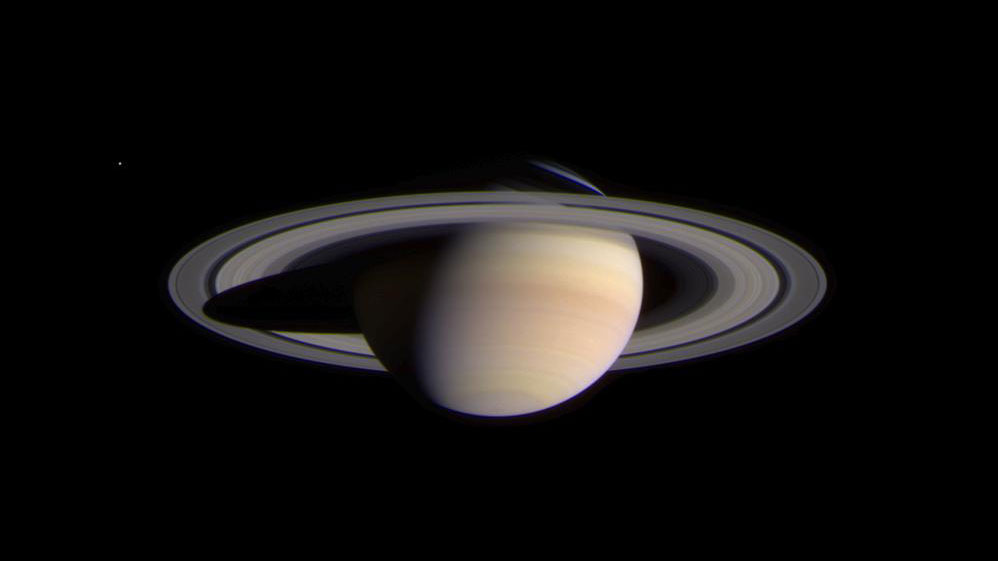

<!-- .slide: class="rs-center" -->

# Reveal slide utilities

<p class="rs-lede rs-mx-auto">
  Live examples and copyable markup for the shared <code>rs-*</code> classes
</p>

<small>Navigate right between feature families and down for usage</small>

---

## Typography and callouts

<p class="rs-kicker">Section label</p>

<p class="rs-lede">
  A lede introduces the subject without competing with the slide title.
</p>

<div class="rs-col-container">
  <blockquote class="rs-col rs-good">Supported</blockquote>
  <blockquote class="rs-col rs-bad">Needs revision</blockquote>
</div>

<p class="rs-takeaway">Takeaways give one conclusion a clear visual anchor.</p>

<p class="rs-citation">
  Citations and asides stay available without taking focus.
</p>

+++

## Typography markup

```html
<section class="rs-center">
  <p class="rs-kicker">Section label</p>
  <p class="rs-lede">Short introduction</p>
  <p class="rs-small">Supporting detail</p>
  <blockquote class="rs-good">Supported</blockquote>
  <blockquote class="rs-bad">Needs revision</blockquote>
  <p class="rs-takeaway">Main conclusion</p>
  <p class="rs-citation">Source or aside</p>
</section>
```

---

## Layout, alignment, and width

<div class="rs-col-container">
  <div class="rs-col rs-centered">
    <div class="rs-card outline">Centered left column</div>
  </div>
  <div class="rs-col rs-centered">
    <div class="rs-card secondary">Centered right column</div>
  </div>
</div>

<p class="rs-takeaway rs-max-w-60 rs-mx-auto">
  This takeaway uses 60% of the slide width and remains centered.
</p>

<div class="rs-overflow-center">
  <div
    class="rs-card outline rs-small"
    style="width: 1050px; text-align: center"
  >
    A 1050px child overflows equally on both sides.
  </div>
</div>

+++

## Layout markup

```html
<div class="rs-col-container">
  <div class="rs-col rs-centered">Left</div>
  <div class="rs-col rs-centered">Right</div>
</div>

<div class="rs-max-w-60 rs-mx-auto">Centered width limit</div>

<div class="rs-overflow-center">
  <div class="wide-content">Centered overflow</div>
</div>
```

<p class="rs-citation">
  Width helpers are available from <code>rs-max-w-50</code> through
  <code>rs-max-w-90</code>.
</p>

---

## Grids and cards

<div class="rs-grid cols-2">
  <div class="rs-card">
    <strong>Default</strong>
    <p>Neutral surface and border</p>
  </div>
  <div class="rs-card secondary">
    <strong>Secondary</strong>
    <p>Themeable supporting emphasis</p>
  </div>
  <div class="rs-card primary">
    <strong>Primary</strong>
    <p>High contrast emphasis</p>
  </div>
  <div class="rs-card rs-inverted">
    <strong>Inverted</strong>
    <p>Quick tonal reversal</p>
  </div>
</div>

+++

## Grid and card markup

```html
<div class="rs-grid cols-2">
  <div class="rs-card">Default</div>
  <div class="rs-card secondary">Secondary</div>
  <div class="rs-card primary">Primary</div>
  <div class="rs-card outline">Outline</div>
</div>

<div class="rs-grid cols-3">...</div>
<div class="rs-card rs-inverted">Inverted</div>
```

---

## Workflows and numbering

<div class="rs-overflow-center">
  <div class="rs-workflow process rs-numbered">
    <div class="rs-card outline step">
      <span class="number"></span><strong>Collect</strong>
    </div>
    <i class="arrow" aria-hidden="true"></i>
    <div class="rs-card outline step">
      <span class="number"></span><strong>Shape</strong>
    </div>
    <i class="arrow" aria-hidden="true"></i>
    <div class="rs-card outline step">
      <span class="number"></span><strong>Review</strong>
    </div>
    <i class="arrow" aria-hidden="true"></i>
    <div class="rs-card outline step">
      <span class="number"></span><strong>Publish</strong>
    </div>
  </div>
</div>

+++

## Workflow markup

```html
<div class="rs-workflow process rs-numbered">
  <div class="rs-card outline step">
    <span class="number"></span>
    <strong>Collect</strong>
  </div>
  <i class="arrow" aria-hidden="true"></i>
  <div class="rs-card outline step">
    <span class="number"></span>
    <strong>Publish</strong>
  </div>
</div>
```

---

## Timelines

<ol class="rs-timeline fade-left fade-right">
  <li class="complete">
    <small>May</small><strong>Plan</strong><span>Scope approved</span>
  </li>
  <li class="complete">
    <small>June</small><strong>Build</strong><span>Core work complete</span>
  </li>
  <li class="current">
    <small>July</small><strong>Review</strong><span>Current milestone</span>
  </li>
  <li>
    <small>August</small><strong>Launch</strong><span>Upcoming work</span>
  </li>
</ol>

+++

## Timeline markup

```html
<ol class="rs-timeline fade-left fade-right">
  <li class="complete"><small>May</small><strong>Plan</strong></li>
  <li class="current"><small>July</small><strong>Review</strong></li>
  <li><small>August</small><strong>Launch</strong></li>
</ol>
```

---

## File trees

<ul class="rs-filetree rs-max-w-60 rs-mx-auto">
  <li>README.md</li>
  <li>
    src/
    <ul>
      <li>main.ts</li>
      <li>styles.scss</li>
      <li>_utilities.scss</li>
    </ul>
  </li>
  <li>
    public/decks/
    <ul>
      <li>features/slides.md</li>
    </ul>
  </li>
  <li class="directory">assets/</li>
</ul>

+++

## File tree markup

```html
<ul class="rs-filetree">
  <li>README.md</li>
  <li>
    src/
    <ul>
      <li>main.ts</li>
      <li>styles.scss</li>
    </ul>
  </li>
  <li class="directory">empty-directory/</li>
</ul>
```

---

## Carousel

<small>Advance through the fragments to move the centered image.</small>

<div class="rs-carousel auto-advance" aria-label="NASA space photographs">
  <figure class="rs-carousel-item">
    
    <figcaption>Earthrise</figcaption>
  </figure>
  <figure class="rs-carousel-item fragment">
    
    <figcaption>Pillars of Creation</figcaption>
  </figure>
  <figure class="rs-carousel-item fragment">
    
    <figcaption>Cassini approaches Saturn</figcaption>
  </figure>
  <figure class="rs-carousel-item fragment">
    
    <figcaption>Spirit's Lookout panorama</figcaption>
  </figure>
  <figure class="rs-carousel-item fragment">
    
    <figcaption>Apollo 11 bootprint</figcaption>
  </figure>
</div>

Note:
Image sources and credits:
Earthrise, NASA: https://science.nasa.gov/resource/image-earthrise/
Pillars of Creation, NASA, ESA, CSA, STScI: https://science.nasa.gov/asset/webb/pillars-of-creation-nircam-image/
Cassini's Approach to Saturn, NASA/JPL/Space Science Institute: https://science.nasa.gov/image-detail/pia05380-saturn-with-rings-16x9/
Lookout Panorama from Spirit, NASA/JPL/Cornell: https://images.nasa.gov/details/PIA07882
Apollo 11 bootprint, NASA: https://science.nasa.gov/photojournal/apollo-footprint/

+++

## Carousel markup

```html
<div class="rs-carousel auto-advance" aria-label="Space photographs">
  <figure class="rs-carousel-item">
    
    <figcaption>Earthrise</figcaption>
  </figure>
  <figure class="rs-carousel-item fragment">
    
    <figcaption>Saturn</figcaption>
  </figure>
  <figure class="rs-carousel-item fragment">
    
    <figcaption>Mars</figcaption>
  </figure>
</div>
```

<p class="rs-citation">
  Add <code>auto-advance</code> to follow Reveal fragments. Use at least three
  items. Add <code>no-frame</code> to an item to display only its image.
  Customize the six <code>--rs-carousel-*</code> properties on the carousel or
  slide.
</p>
